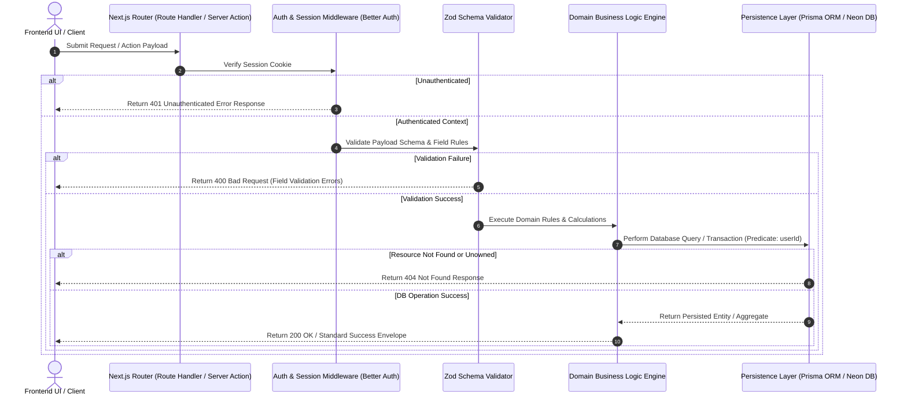
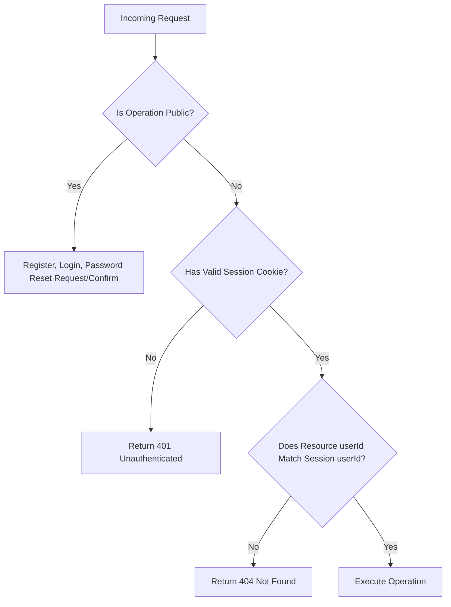
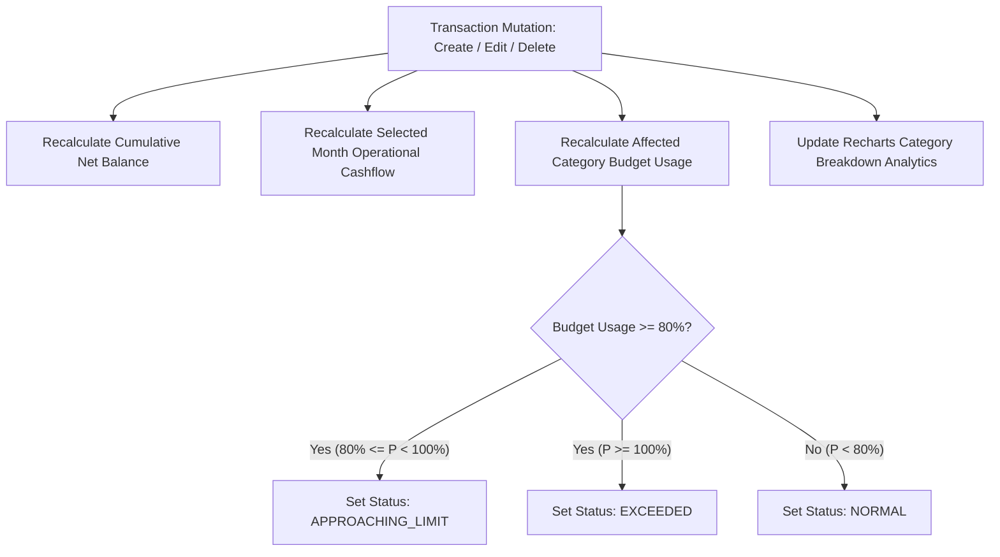

# Backend Architecture & API Design Specification

**Application:** Personal Finance Manager (v1.0 MVP)  
**Role:** Senior Backend Architect & API Designer  
**Status:** Authoritative Technical Specification  
**Traceability:** Implements requirements from [product-requirements.md](file:///home/blart/Documents/webProjects/FinanceManager/docs/product-requirements.md), [business-rules-and-edge-cases.md](file:///home/blart/Documents/webProjects/FinanceManager/docs/business-rules-and-edge-cases.md), [system-architecture.md](file:///home/blart/Documents/webProjects/FinanceManager/docs/system-architecture.md), and [database-design.md](file:///home/blart/Documents/webProjects/FinanceManager/docs/database-design.md).

---

## 1. Executive Summary

This document serves as the authoritative backend and API design specification for the **Personal Finance Manager** web application. It defines the software architecture, API contracts, authorization mechanisms, business logic boundaries, error handling standards, and database interactions required to build a secure, robust, and performant financial management system.

The application manages personal financial records; therefore, strict data ownership, row-level multi-tenant isolation, precise fixed-point financial calculations, and complete hard-purge account deletion capabilities are treated as non-negotiable architectural imperatives.

---

## 2. Backend Architecture

### 2.1 Backend Responsibilities
The backend acts as the authoritative boundary for business rules, data persistence, and security enforcement. Its responsibilities comprise:
1. **Identity & Session Management:** Authenticating users, managing session token cookies, issuing password reset tokens, and handling session invalidation via **Better Auth**.
2. **Authorization & Data Isolation:** Enforcing row-level multi-tenant boundaries. User interface hiding is treated as zero security; every backend operation verifies that the target resource belongs to the authenticated `userId` ([BR-008](file:///home/blart/Documents/webProjects/FinanceManager/docs/business-rules.md#L45)).
3. **Boundary Input Validation:** Sanitizing and validating all incoming payloads via **Zod** schemas before executing business logic.
4. **Domain Rule Engine:** Executing pure TypeScript financial calculations including Cumulative Net Account Balance ($\sum \text{Income} - \sum \text{Expense}$, [BR-020](file:///home/blart/Documents/webProjects/FinanceManager/docs/business-rules.md#L112)), Monthly Operational Cashflow, Category Budget Usage ($P_b$), and Savings Goal Progress ($P_g$).
5. **Dynamic Recalculation Engine:** Recalculating affected historical summaries, net balances, and budget states whenever transactions are created, edited, or deleted—including historical backdated entries ([BR-006](file:///home/blart/Documents/webProjects/FinanceManager/docs/business-rules.md#L32)).
6. **Atomic Category Reassignment:** Ensuring custom categories with active transactions cannot be deleted until those transactions are atomically reassigned to another active category or system `"Uncategorized"` default ([BR-013](file:///home/blart/Documents/webProjects/FinanceManager/docs/business-rules.md#L73)).
7. **Compliance Hard Purging:** Executing cascading hard erasures across all dependent models upon user account deletion ([BR-019](file:///home/blart/Documents/webProjects/FinanceManager/docs/business-rules.md#L106)).

### 2.2 Request Lifecycle
All HTTP requests and Next.js Server Action invocations follow a deterministic, 6-step lifecycle:



### 2.3 Backend Layers
The backend is structured into four strictly decoupled layers adhering to Pragmatic Clean Architecture principles:

```
┌────────────────────────────────────────────────────────────────────────┐
│                        1. Presentation Layer                           │
│     Next.js App Router (RSC Data Fetching & Client Component Forms)     │
└───────────────────────────────────┬────────────────────────────────────┘
                                    │
┌───────────────────────────────────▼────────────────────────────────────┐
│                  2. Application / API Layer                           │
│  Server Actions & Route Handlers (/api/auth) + Zod Input Parsing       │
└───────────────────────────────────┬────────────────────────────────────┘
                                    │
┌───────────────────────────────────▼────────────────────────────────────┐
│                    3. Domain Core Engine Layer                         │
│  Pure TypeScript Business Logic (Net Balance, Budget State, Savings)   │
│  * ZERO External Dependencies on React, Next.js, or Database ORMs *    │
└───────────────────────────────────┬────────────────────────────────────┘
                                    │
┌───────────────────────────────────▼────────────────────────────────────┐
│                  4. Infrastructure / Persistence                       │
│      Better Auth, Prisma ORM, Neon Serverless PostgreSQL Database       │
└────────────────────────────────────────────────────────────────────────┘
```

### 2.4 Relationship with Frontend
* **Server Actions:** Handle all data mutations (Forms, Creation, Modification, Deletion). Server Actions provide end-to-end TypeScript safety directly imported into React Hook Form implementations.
* **React Server Components (RSC):** Execute initial page data fetching directly on the server, avoiding client-side waterfall network requests ([ADR-001](file:///home/blart/Documents/webProjects/FinanceManager/docs/technology-decisions.md#L16)).
* **TanStack Query (React Query):** Manages client-side cache state, background invalidation, and optimistic updates after Server Action mutations ([ADR-008](file:///home/blart/Documents/webProjects/FinanceManager/docs/technology-decisions.md#L122)).

### 2.5 Relationship with Database
* Data persistence is managed via **Prisma ORM** connecting to **Neon PostgreSQL** ([ADR-004](file:///home/blart/Documents/webProjects/FinanceManager/docs/technology-decisions.md#L62)).
* **Monetary Precision:** All currency fields (`amount`, `spendingLimit`, `targetAmount`, `accumulatedBalance`) use PostgreSQL `DECIMAL(12,2)` mapping to Prisma `Decimal` objects to prevent floating-point rounding errors.
* **Temporal Integrity:** All timestamps are normalized to UTC (`TIMESTAMPTZ` / `DateTime`) ([BR-012](file:///home/blart/Documents/webProjects/FinanceManager/docs/business-rules.md#L69)).

### 2.6 Relationship with Authentication
* Identity management uses **Better Auth** with session tokens stored in secure `HttpOnly`, `SameSite=Lax` cookies ([ADR-005](file:///home/blart/Documents/webProjects/FinanceManager/docs/technology-decisions.md#L77)).
* Better Auth interacts directly with `User`, `Session`, `Account`, and `VerificationToken` tables in PostgreSQL.
* Every protected Server Action extracts session context (`session.user.id`) prior to executing domain logic.

---

## 3. API Design Principles

### 3.1 Naming Conventions
* **Route Handlers:** Lowercase kebab-case paths (e.g., `/api/auth/sign-in`, `/api/auth/reset-password`).
* **Server Actions:** Named using `verb + Entity + Action` format in camelCase (e.g., `createTransactionAction`, `deleteCategoryAction`).
* **Field Names:** Standard camelCase across all JSON payloads and TypeScript types (`userId`, `categoryId`, `transactionDate`, `merchantName`, `preferredCurrencySymbol`).

### 3.2 HTTP Methods & Mutation Conventions
* **GET:** Read-only data retrieval (via React Server Components or Route Handlers).
* **POST:** Account registration, login, session creation, password reset, transaction/budget/goal creation.
* **PUT / PATCH:** Entity updates (profile details, preferences, transaction edits).
* **DELETE:** Entity deletion (transaction purge, category removal, account deletion).

### 3.3 Response Conventions
All API Route Handlers and Server Actions return a uniform response envelope:

```typescript
// Success Response Envelope
type ActionSuccessResponse<T> = {
  success: true;
  data: T;
  meta?: {
    page?: number;
    pageSize?: number;
    totalCount?: number;
    totalPages?: number;
  };
};

// Error Response Envelope
type ActionErrorResponse = {
  success: false;
  error: {
    code: ErrorCode;
    message: string;
    fieldErrors?: Record<string, string[]>;
  };
};

type ApiResponse<T> = ActionSuccessResponse<T> | ActionErrorResponse;
```

### 3.4 Error Conventions & Status Codes
* **200 OK:** Request or Server Action succeeded.
* **400 Bad Request (`INVALID_INPUT`):** Zod boundary validation failure (returns structured `fieldErrors`).
* **401 Unauthorized (`UNAUTHENTICATED`):** Unauthenticated request or expired session.
* **404 Not Found (`NOT_FOUND` / `FORBIDDEN_RESOURCE`):** Resource does not exist or is owned by another user.
* **409 Conflict (`CONFLICT`):** Duplicate email address or duplicate category name.
* **422 Unprocessable Entity (`BUSINESS_RULE_VIOLATION`):** Domain logic rule breach (e.g. `amount <= 0`, category type mismatch, missing reassignment target).
* **500 Internal Server Error (`INTERNAL_ERROR`):** System error (stack trace hidden in production).

### 3.5 Pagination
* Paginated endpoints (`getTransactionsAction`) accept `page` (default `1`) and `pageSize` (default `20`, max `100`).
* Response metadata includes `totalCount`, `totalPages`, `page`, and `pageSize`.

### 3.6 Filtering & Sorting
* **Filtering Parameters:** `type` (`INCOME` | `EXPENSE`), `categoryId`, `startDate`, `endDate`, `minAmount`, `maxAmount`.
* **Search Parameter:** `query` (matches substring against `merchantName` or `notes`).
* **Sorting Parameters:** `sortBy` (`transactionDate` | `amount` | `createdAt`), `sortOrder` (`asc` | `desc`, default `desc`).

### 3.7 Date Handling
* All input dates must be valid ISO-8601 strings or JS Date objects converted to UTC before persistence.
* Evaluation boundaries for monthly cashflows and budgets run strictly from `00:00:00.000 UTC` on the 1st of the month to `23:59:59.999 UTC` on the final day of the month ([BR-014](file:///home/blart/Documents/webProjects/FinanceManager/docs/business-rules.md#L81)).

### 3.8 Validation
* All backend boundaries parse incoming arguments through Zod schemas. Zero unvalidated data reaches domain models or the database layer.

---

## 4. Authentication & Authorization

### 4.1 Public vs. Protected Operations



* **Public Operations:** `registerUser`, `loginUser`, `requestPasswordReset`, `confirmPasswordReset`.
* **Protected Operations:** All transaction, category, budget, savings goal, profile, analytics, and account deletion operations.

### 4.2 Resource Ownership & User Isolation
* Multi-tenancy is enforced at the query layer. Every SQL/Prisma query automatically injects `where: { userId: session.user.id }` ([BR-008](file:///home/blart/Documents/webProjects/FinanceManager/docs/business-rules.md#L45)).
* Pre-seeded default categories (`isSystemDefault = true`, `userId = null`) are accessible read-only to all authenticated users ([BR-017](file:///home/blart/Documents/webProjects/FinanceManager/docs/business-rules.md#L94)).

### 4.3 Account Deletion Behavior (Hard Purge)
Account deletion (`deleteAccountAction`) executes a single atomic database transaction (`prisma.$transaction`) that permanently purges:
1. User profile data (`Profile`)
2. Active sessions & auth accounts (`Session`, `Account`)
3. All income and expense ledger records (`Transaction`)
4. Custom user categories (`Category`)
5. All monthly budgets (`Budget`)
6. All savings goals (`SavingsGoal`)
7. User core identity (`User`)

Account deletion cannot be undone ([BR-019](file:///home/blart/Documents/webProjects/FinanceManager/docs/business-rules.md#L106)).

---

## 5. Transaction Operations

### 5.1 Create Transaction (`createTransactionAction`)
* **Purpose:** Records a new financial income or expense entry.
* **Actor:** Authenticated User.
* **Auth Requirement:** Active Session Cookie.
* **Authorization Requirement:** Must own the selected category (or category must be a system default matching transaction type).
* **Input Schema:**
  ```typescript
  const CreateTransactionSchema = z.object({
    amount: z.number().positive("Amount must be greater than zero."),
    type: z.enum(["INCOME", "EXPENSE"]),
    categoryId: z.string().min(1, "Category is required."),
    transactionDate: z.coerce.date(),
    merchantName: z.string().trim().max(100).optional(),
    notes: z.string().trim().max(500).optional(),
  });
  ```
* **Validation & Business Rules:**
  1. `amount > 0` ([BR-004](file:///home/blart/Documents/webProjects/FinanceManager/docs/business-rules.md#L21)).
  2. Category must exist and `Category.type` must match `Transaction.type`.
  3. Supports historical backdating ([FR-027](file:///home/blart/Documents/webProjects/FinanceManager/docs/product-requirements.md#L150)).
* **Success Result:** Returns created `Transaction` object.
* **Side Effects:** Triggers real-time dynamic recalculation of Net Cumulative Balance, Monthly Cashflow, Category Budget Usage, and Recharts analytics ([BR-006](file:///home/blart/Documents/webProjects/FinanceManager/docs/business-rules.md#L32)).

### 5.2 Read Transactions (`getTransactionsAction`)
* **Purpose:** Retrieves paginated, filtered, and searched transaction records.
* **Actor:** Authenticated User.
* **Input Parameters:** `page`, `pageSize`, `type`, `categoryId`, `startDate`, `endDate`, `minAmount`, `maxAmount`, `query`, `sortBy`, `sortOrder`.
* **Authorization:** Scoped strictly to `where: { userId: session.user.id }`.
* **Success Result:** Returns `Transaction[]` array with pagination metadata.

### 5.3 Update Transaction (`updateTransactionAction`)
* **Purpose:** Modifies existing transaction attributes (amount, date, category, merchant, notes).
* **Actor:** Authenticated User (Owner).
* **Validation & Business Rules:** Same as creation. Supports backdating edits ([FR-021](file:///home/blart/Documents/webProjects/FinanceManager/docs/product-requirements.md#L109)).
* **Side Effects:** Dynamically recalculates historical cashflow for previous transaction date (if date changed) and current/new transaction date ([BR-006](file:///home/blart/Documents/webProjects/FinanceManager/docs/business-rules.md#L32)).

### 5.4 Delete Transaction (`deleteTransactionAction`)
* **Purpose:** Permanently removes a transaction record.
* **Actor:** Authenticated User (Owner).
* **Business Rules:** Deleted transactions cannot be recovered ([BR-011](file:///home/blart/Documents/webProjects/FinanceManager/docs/business-rules.md#L65)).
* **Side Effects:** Immediately updates cumulative balance and affected monthly category budget progress.

---

## 6. Category Operations

### 6.1 List Categories (`getCategoriesAction`)
* **Purpose:** Fetches all available categories for the user (combines system defaults + user custom categories).
* **Business Rules:** Returns default system categories (`userId = null`) plus custom categories (`userId = session.user.id`) classified by `type` (`INCOME` / `EXPENSE`).

### 6.2 Create Custom Category (`createCategoryAction`)
* **Purpose:** Adds a user-defined category.
* **Input Schema:** `name` (string 1–50 chars), `type` (`INCOME` | `EXPENSE`).
* **Validation & Business Rules:** Enforces name uniqueness per user per type (`EC-008`). System defaults cannot be duplicated.

### 6.3 Update Custom Category (`updateCategoryAction`)
* **Purpose:** Renames or modifies a custom category.
* **Business Rules:** System default categories (`isSystemDefault = true`) are read-only and cannot be updated.

### 6.4 Delete Custom Category with Atomic Transaction Reassignment (`deleteCategoryAction`)
* **Purpose:** Deletes a custom category safely.
* **Actor:** Authenticated User (Owner).
* **Input Schema:**
  ```typescript
  const DeleteCategorySchema = z.object({
    categoryId: z.string().min(1),
    reassignToCategoryId: z.string().min(1, "Reassignment category target is required."),
  });
  ```
* **Validation & Business Rules:**
  1. System default categories cannot be deleted ([BR-017](file:///home/blart/Documents/webProjects/FinanceManager/docs/business-rules.md#L94)).
  2. If the category has assigned transactions, `reassignToCategoryId` must be specified ([BR-013](file:///home/blart/Documents/webProjects/FinanceManager/docs/business-rules.md#L73)).
  3. `reassignToCategoryId` must be an active custom category or system default `"Uncategorized"` matching the category's `type`.
* **Execution:** Wrapped in `prisma.$transaction`:
  - Step A: `UPDATE Transaction SET categoryId = reassignToCategoryId WHERE categoryId = categoryId AND userId = session.user.id`
  - Step B: `DELETE FROM Category WHERE id = categoryId AND userId = session.user.id`

---

## 7. Budget Operations

### 7.1 Upsert Monthly Category Budget (`upsertBudgetAction`)
* **Purpose:** Creates or updates a spending ceiling for a specific category in a calendar month.
* **Input Schema:**
  ```typescript
  const UpsertBudgetSchema = z.object({
    categoryId: z.string().min(1),
    spendingLimit: z.number().positive("Spending limit must be greater than zero."),
    year: z.number().int().min(2000).max(2100),
    month: z.number().int().min(1).max(12),
  });
  ```
* **Business Rules:**
  1. Category must be an `EXPENSE` type category.
  2. Enforces composite uniqueness: 1 budget per category per calendar month (`@@unique([userId, categoryId, year, month])`, [BR-014](file:///home/blart/Documents/webProjects/FinanceManager/docs/business-rules.md#L81)).

### 7.2 Budget Warning Calculation Engine
Budget usage and warning indicators are evaluated dynamically:
$$\text{Spent Amount } (S) = \sum \text{Amount}(\text{Transactions}_{\text{EXPENSE}, c, m})$$
$$\text{Progress Percentage } (P_b) = \left( \frac{S}{\text{spendingLimit}} \right) \times 100$$

* **Warning State Rules ([FR-044](file:///home/blart/Documents/webProjects/FinanceManager/docs/product-requirements.md#L238)):**
  - $P_b < 80\%$: `NORMAL` (Standard display)
  - $80\% \le P_b < 100\%$: `APPROACHING_LIMIT` (Yellow Warning Indicator)
  - $P_b \ge 100\%$: `EXCEEDED` (Red Alert Indicator + display overrun amount $S - \text{spendingLimit}$)

---

## 8. Savings Goal Operations

### 8.1 Create Savings Goal (`createSavingsGoalAction`)
* **Input Schema:** `name` (string), `targetAmount` (> 0), `targetCompletionDate` (future Date).
* **Initial State:** `accumulatedBalance = 0.00`, `status = IN_PROGRESS`.

### 8.2 Record Savings Contribution (`recordSavingsContributionAction`)
* **Purpose:** Increments savings progress toward a target.
* **Input Schema:**
  ```typescript
  const RecordContributionSchema = z.object({
    goalId: z.string().min(1),
    amount: z.number().positive("Contribution amount must be greater than zero."),
  });
  ```
* **Execution & Business Rules ([BR-016](file:///home/blart/Documents/webProjects/FinanceManager/docs/business-rules.md#L88)):**
  1. Atomically increments `accumulatedBalance += amount`.
  2. Recalculates progress percentage: $P_g = \left( \frac{\text{accumulatedBalance}}{\text{targetAmount}} \right) \times 100$.
  3. If $\text{accumulatedBalance} \ge \text{targetAmount}$, transitions `status` to `COMPLETED` ([FR-055](file:///home/blart/Documents/webProjects/FinanceManager/docs/product-requirements.md#L282)).

---

## 9. Dashboard & Analytics Operations

### 9.1 Get Dashboard Summary (`getDashboardSummaryAction`)
* **Purpose:** Provides unified aggregated financial health data.
* **Input Parameter:** `calendarMonth` (year, month).
* **Calculated Output Envelope:**
  ```typescript
  type DashboardSummaryResponse = {
    cumulativeNetBalance: string; // "1250.50" or "-250.00" (BR-020)
    monthlyIncomeTotal: string;
    monthlyExpenseTotal: string;
    monthlyNetCashflow: string;
    recentTransactions: Transaction[];
    budgetWarningCount: number;
    preferredCurrencySymbol: string; // "$", "€", etc. (BR-018)
  };
  ```

### 9.2 Spending Analytics (`getSpendingAnalyticsAction`)
* **Calculated Output:** Aggregates expense transaction totals grouped by category for the selected month to feed Recharts visualization views ([FR-015](file:///home/blart/Documents/webProjects/FinanceManager/docs/product-requirements.md#L92)).

---

## 10. Profile & Settings Operations

### 10.1 Update Profile Preferences (`updatePreferencesAction`)
* **Input Schema:** `displayName` (optional), `preferredCurrencySymbol` (`"$"`, `"€"`, `"£"`, `"¥"`), `themePreference` (`"light"` | `"dark"`).
* **Business Rules:** Updates visual display formatting prefix without modifying stored numerical ledger amounts ([BR-018](file:///home/blart/Documents/webProjects/FinanceManager/docs/business-rules.md#L100)).

---

## 11. Authorization Matrix

| Backend Operation | Guest | Authenticated (Owner) | Authenticated (Non-Owner) |
| :--- | :---: | :---: | :---: |
| `registerUser` / `loginUser` | ✅ Allowed | ❌ Blocked | ❌ Blocked |
| `requestPasswordReset` | ✅ Allowed | ✅ Allowed | N/A |
| `getDashboardSummary` | ❌ 401 Unauthorized | ✅ 200 OK | N/A |
| `createTransaction` | ❌ 401 Unauthorized | ✅ 200 OK | N/A |
| `updateTransaction` | ❌ 401 Unauthorized | ✅ 200 OK | ❌ 404 Not Found |
| `deleteTransaction` | ❌ 401 Unauthorized | ✅ 200 OK | ❌ 404 Not Found |
| `createCustomCategory` | ❌ 401 Unauthorized | ✅ 200 OK | N/A |
| `deleteCustomCategory` | ❌ 401 Unauthorized | ✅ 200 OK (With Reassignment) | ❌ 404 Not Found |
| `upsertBudget` | ❌ 401 Unauthorized | ✅ 200 OK | ❌ 404 Not Found |
| `recordSavingsContribution` | ❌ 401 Unauthorized | ✅ 200 OK | ❌ 404 Not Found |
| `deleteAccount` | ❌ 401 Unauthorized | ✅ 200 OK (Hard Purge) | N/A |

---

## 12. Business Side Effects Engine



* **Backdated Edits Handling:** Editing a transaction date from Month $A$ to Month $B$ triggers side effect updates across **both** Month $A$ and Month $B$ budget usages and cashflow totals ([BR-006](file:///home/blart/Documents/webProjects/FinanceManager/docs/business-rules.md#L32)).

---

## 13. Security Considerations

1. **Multi-Tenant Isolation:** Enforced via mandatory `userId` predicates in Prisma repository wrappers.
2. **Account Hard Purging:** Complete data erasure on account deletion complying with privacy standards ([BR-019](file:///home/blart/Documents/webProjects/FinanceManager/docs/business-rules.md#L106)).
3. **Password Security:** Handled via Better Auth using Argon2id/bcrypt password hashing.
4. **Anti-Enumeration Protection:** Accessing unowned resource IDs returns `404 Not Found` rather than `403 Forbidden` to hide resource existence.
5. **CSRF & Injection Mitigation:** Server Actions use built-in Next.js CSRF tokens; Prisma ORM uses parameterized queries preventing SQL injection.

---

## 14. Performance Considerations

* **Dashboard Latency:** Target < 2 seconds page load ([NFR Performance](file:///home/blart/Documents/webProjects/FinanceManager/docs/product-requirements.md#L163)).
* **Database B-Tree Indexing Strategy:**
  - `Transaction(userId, transactionDate DESC)` — Optimizes main ledger feeds & recent activity.
  - `Transaction(userId, categoryId, transactionDate)` — Accelerates category budget aggregations.
  - `Transaction(userId, type, amount)` — Speeds up Net Balance `SUM(Income) - SUM(Expense)` queries.
  - `Budget(userId, categoryId, year, month)` — Unique index for instant budget lookups.

---

## 15. Future Extensibility

* **Multi-Currency FX Support (v2.0):** The `Transaction` table schema includes reserved optional `originalAmount` and `exchangeRate` fields to support FX conversion without breaking nominal `Decimal(12,2)` amount contracts.
* **Bank Sync Integration (v2.0):** `Transaction` model supports an optional `externalId` field for bank aggregator deduplication.
