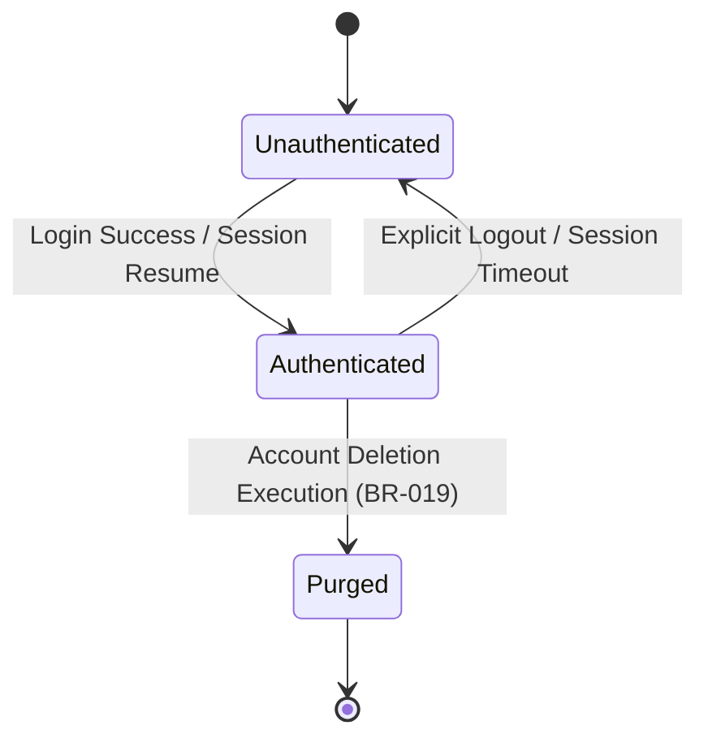
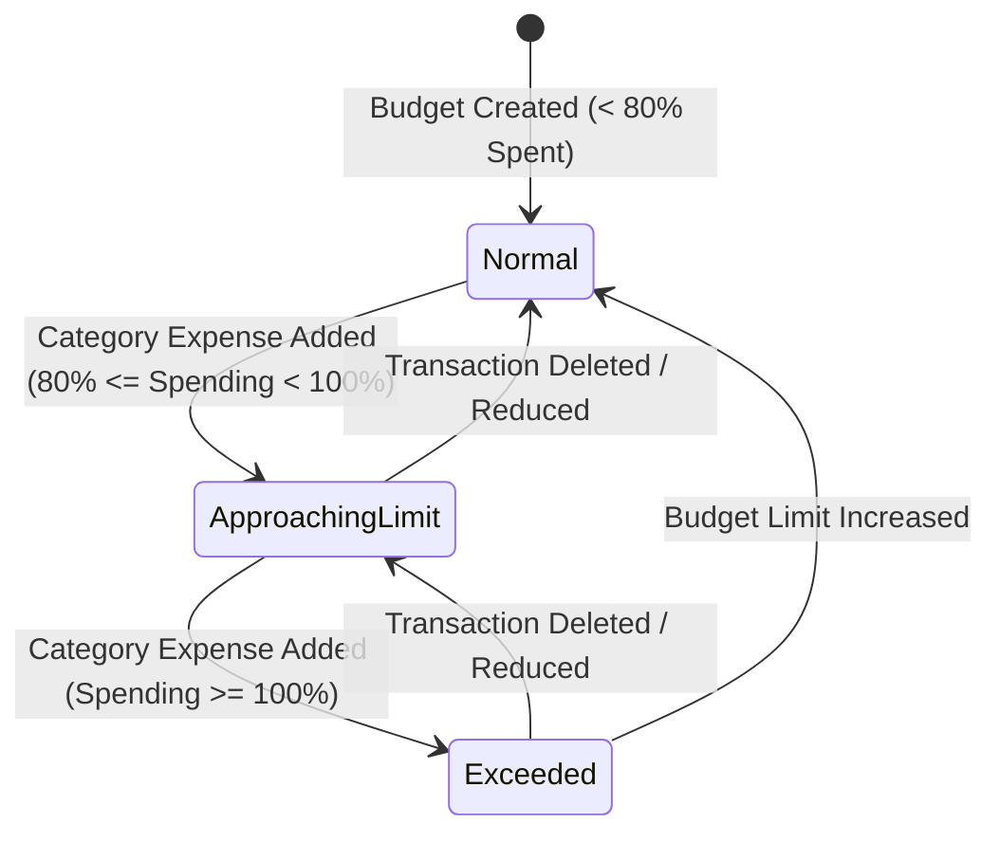
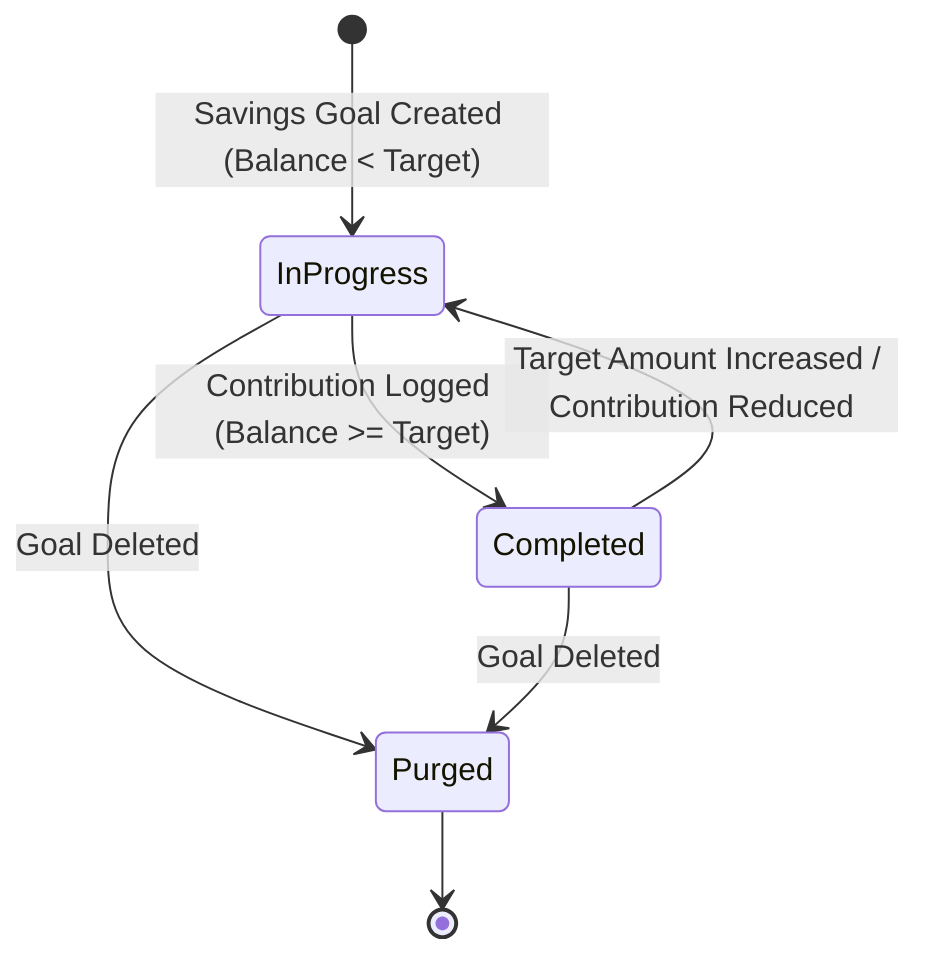
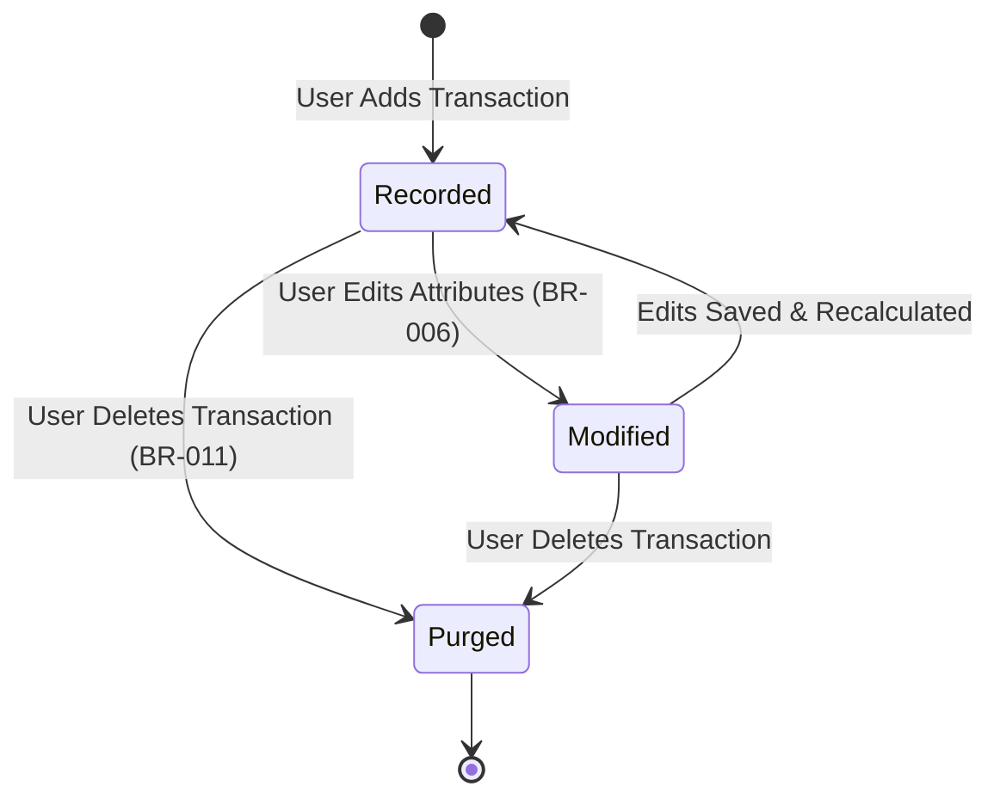

# Business Rules & Edge Cases

## Application: Personal Finance Manager
**Role:** Senior Business Analyst & Domain Expert  
**Status:** Canonical Reference for Business Logic, State Transitions & Edge Cases  
**Traceability:** [product-requirements.md](file:///home/blart/Documents/webProjects/FinanceManager/docs/product-requirements.md) | [business-rules.md](file:///home/blart/Documents/webProjects/FinanceManager/docs/business-rules.md) | [domain-analysis.md](file:///home/blart/Documents/webProjects/FinanceManager/docs/domain-analysis.md)

---

# 1. Master Business Rules Catalog

| Rule ID | Core Business Rule | Operational Context & Policy |
| :--- | :--- | :--- |
| **BR-001** | Every registered user must have a unique email address. | Uniqueness enforced during registration and profile update workflows ([FR-001](file:///home/blart/Documents/webProjects/FinanceManager/docs/product-requirements.md#L13), [FR-060](file:///home/blart/Documents/webProjects/FinanceManager/docs/product-requirements.md#L291)). |
| **BR-002** | Each transaction belongs to exactly one authenticated user. | Strict multi-tenant data isolation; cross-user data access is strictly prohibited ([BR-008](file:///home/blart/Documents/webProjects/FinanceManager/docs/business-rules.md#L45)). |
| **BR-003** | Every transaction must belong to exactly one valid category. | Transactions cannot exist in an unassigned state. |
| **BR-004** | Transaction monetary amounts must be strictly greater than zero. | Zero ($0.00) and negative numerical entries are invalid ([FR-020](file:///home/blart/Documents/webProjects/FinanceManager/docs/product-requirements.md#L101)). |
| **BR-005** | Every transaction must be classified as either Income or Expense. | Binary cashflow classification drives net balance and dashboard analytics. |
| **BR-006** | Adding, editing, or deleting a transaction (including historical backdated entries) immediately triggers dynamic recalculation of dashboard totals, monthly summaries, and affected budget progress. | Real-time dynamic consistency model across historical and current windows ([FR-028](file:///home/blart/Documents/webProjects/FinanceManager/docs/product-requirements.md#L157)). |
| **BR-007** | Budget progress is automatically recalculated whenever transactions change. | Budget progress monitors category expenditure dynamically. |
| **BR-008** | Users cannot access another user's financial information. | Domain privacy and isolation enforcement. |
| **BR-009** | Savings goals must have positive target values. | Target amount must be greater than zero. |
| **BR-010** | Only authenticated users may create, edit, or delete financial data. | Guest actors are restricted to registration and login workflows. |
| **BR-011** | Deleted transactions cannot be recovered. | Purged transactions are permanently removed from calculations. |
| **BR-012** | All timestamps and transaction dates should be stored using UTC. | Ensures temporal consistency across timezone boundaries. |
| **BR-013** | Custom categories can only be deleted after all associated transactions are reassigned to another active category or moved to a system default "Uncategorized" category. | Prevents orphaned transactions and maintains categorization integrity ([FR-035](file:///home/blart/Documents/webProjects/FinanceManager/docs/product-requirements.md#L201)). |
| **BR-014** | A budget applies to one category during one calendar month. | Evaluation period runs from 00:00 UTC on the 1st to 23:59 UTC on the final calendar day of the month. |
| **BR-015** | Dashboard summaries are generated dynamically from transaction data. | Eliminates cached static stale data. |
| **BR-016** | Savings goal progress is updated via explicit progress entries or contributions; progress percentages are calculated dynamically based on target amounts. | Incremental progress logging toward targets ([FR-054](file:///home/blart/Documents/webProjects/FinanceManager/docs/product-requirements.md#L275)). |
| **BR-017** | The system provides pre-seeded read-only default categories for common income and expense types; user-created custom categories may be edited or deleted by the owning user. | Onboarding enablement ([FR-033](file:///home/blart/Documents/webProjects/FinanceManager/docs/product-requirements.md#L187)). System defaults cannot be deleted. |
| **BR-018** | Preferred currency settings control display formatting symbols globally and do not execute exchange rate conversions. | Nominal amount visual prefix formatting ([FR-062](file:///home/blart/Documents/webProjects/FinanceManager/docs/product-requirements.md#L305)). |
| **BR-019** | Account deletion permanently purges all user profile information, transactions, budgets, categories, and savings goals, and cannot be undone. | Hard compliance purging ([FR-006](file:///home/blart/Documents/webProjects/FinanceManager/docs/product-requirements.md#L48)). |
| **BR-020** | Total account balance is calculated as cumulative income minus cumulative expenses; when total expenses exceed income, the balance shall be presented as a negative value formatted according to the user's preferred currency symbol. | Allows negative overall financial balance display ([FR-010](file:///home/blart/Documents/webProjects/FinanceManager/docs/product-requirements.md#L57)). |

---

# 2. Business Logic & Mathematical Calculation Models

### 2.1 Net Cumulative Account Balance
$$\text{Net Balance} = \sum \text{Amount}(\text{Transactions}_{\text{Income}}) - \sum \text{Amount}(\text{Transactions}_{\text{Expense}})$$
* **Rules:**
  * Evaluates across **all historical transactions** up to the selected date threshold.
  * If $\sum \text{Expense} > \sum \text{Income}$, result is negative and formatted as e.g., `-$150.00` or `-€150.00` depending on preferred currency symbol ([BR-020](file:///home/blart/Documents/webProjects/FinanceManager/docs/business-rules.md#L112)).

### 2.2 Monthly Operational Cashflow Summary
$$\text{Monthly Net Cashflow} = \sum \text{Amount}(\text{Income}_{m}) - \sum \text{Amount}(\text{Expense}_{m})$$
* **Rules:**
  * Filtered strictly by transaction dates falling within calendar month $m$ (1st day 00:00:00 UTC to last day 23:59:59 UTC).

### 2.3 Category Budget Progress & Warning Thresholds
$$\text{Category Expenditure Percentage } (P_b) = \left( \frac{\sum \text{Amount}(\text{Expense}_{c, m})}{\text{Budget Limit}_{c, m}} \right) \times 100$$
* **Decision Rules:**
  * **Normal State ($P_b < 80\%$):** Display standard progress visual bar.
  * **Approach Warning State ($80\% \le P_b < 100\%$):** Display **Yellow Warning Indicator** ([FR-044](file:///home/blart/Documents/webProjects/FinanceManager/docs/product-requirements.md#L238)).
  * **Exceeded State ($P_b \ge 100\%$):** Display **Red Alert Indicator** and display overrun amount ($\text{Actual Expense} - \text{Budget Limit}$).

### 2.4 Savings Goal Progress & Target Status
$$\text{Goal Progress Percentage } (P_g) = \left( \frac{\sum \text{Contributions}}{\text{Target Amount}} \right) \times 100$$
* **Decision Rules:**
  * **In Progress ($P_g < 100\%$):** Goal status remains `In Progress`.
  * **Completed ($P_g \ge 100\%$):** Goal status transitions to `Completed` ([FR-055](file:///home/blart/Documents/webProjects/FinanceManager/docs/product-requirements.md#L282)). Contributions exceeding 100% are recorded and displayed as surplus savings.

---

# 3. State Transitions

### 3.1 User Session State Transition

### 3.2 Category Budget State Transition

### 3.3 Savings Goal State Transition

### 3.4 Transaction Lifecycle State Transition

---

# 4. Business Edge Cases & Handlers

| Edge Case ID | Scenario | Business Context | Expected Business Behavior |
| :--- | :--- | :--- | :--- |
| **EC-001** | **Empty Dashboard (New Account):** User logs in for the first time with zero transactions. | No financial records exist yet. | Dashboard displays `$0.00` Net Balance, `$0.00` Income, `$0.00` Expense, an empty recent activity state, and prompts user to add their first transaction. |
| **EC-002** | **Negative Cumulative Balance:** Total historical expenses exceed total income. | User is in net debt/overdraft position. | Net Balance Card displays formatted negative amount (e.g., `-$250.00`) with visual negative indicator ([BR-020](file:///home/blart/Documents/webProjects/FinanceManager/docs/business-rules.md#L112)). |
| **EC-003** | **Budget Overrun (100%+):** Transaction pushes monthly category spending past budget limit. | Spending limit breach. | System saves transaction successfully, updates category spending, immediately turns budget indicator Red, and displays overspend amount ([FR-044](file:///home/blart/Documents/webProjects/FinanceManager/docs/product-requirements.md#L238)). Transactions are **never blocked** due to budget overruns. |
| **EC-004** | **Custom Category Deletion with Active Transactions:** User attempts to delete a custom category assigned to 50 transactions. | Category lifecycle constraint ([BR-013](file:///home/blart/Documents/webProjects/FinanceManager/docs/business-rules.md#L73)). | System blocks immediate deletion and displays mandatory reassignment modal. User must select another active custom/system category or system "Uncategorized" default. Once selected, all 50 transactions are reassigned and the category is purged. |
| **EC-005** | **Zero or Negative Value Entry Attempt:** User enters `$0.00` or `-$50.00` in transaction amount field. | Amount validation breach ([BR-004](file:///home/blart/Documents/webProjects/FinanceManager/docs/business-rules.md#L21)). | System rejects submission and displays validation error: *"Transaction amount must be greater than zero."* |
| **EC-006** | **Historical Backdated Transaction Edit:** User adds an expense dated 3 months ago. | Retroactive ledger change. | System saves transaction with past date, dynamically recalculates historical monthly summary for that month, updates retroactive budget progress for that past month, and updates current net balance ([BR-006](file:///home/blart/Documents/webProjects/FinanceManager/docs/business-rules.md#L32)). |
| **EC-007** | **Mid-Stream Currency Symbol Change:** User changes currency symbol setting from `$` to `€` after logging 100 transactions. | Display symbol update ([BR-018](file:///home/blart/Documents/webProjects/FinanceManager/docs/business-rules.md#L100)). | System updates all visual amount prefixes globally from `$` to `€` (e.g., `$100.00` becomes `€100.00`). Numerical values remain unchanged without exchange rate conversion. |
| **EC-008** | **Duplicate Category Name Creation:** User creates a custom category with a name matching an existing custom or system category. | Uniqueness policy. | System blocks creation and displays validation error: *"A category with this name already exists for your account."* |
| **EC-009** | **Future-Dated Transaction Entry:** User logs an income transaction dated 2 weeks in the future. | Anticipated future cashflow. | System saves transaction. Future-dated transactions are included in total net balance calculation, but excluded from current month operational cashflow until the effective date is reached. |
| **EC-010** | **Leap Year & Month Boundary Calculation:** User creates a budget for February during a leap year (29 days vs 28 days). | Month length variance ([BR-014](file:///home/blart/Documents/webProjects/FinanceManager/docs/business-rules.md#L81)). | System dynamically determines exact start (Feb 1 00:00:00 UTC) and end (Feb 28/29 23:59:59 UTC) timestamps based on calendar year leap year rules. |
