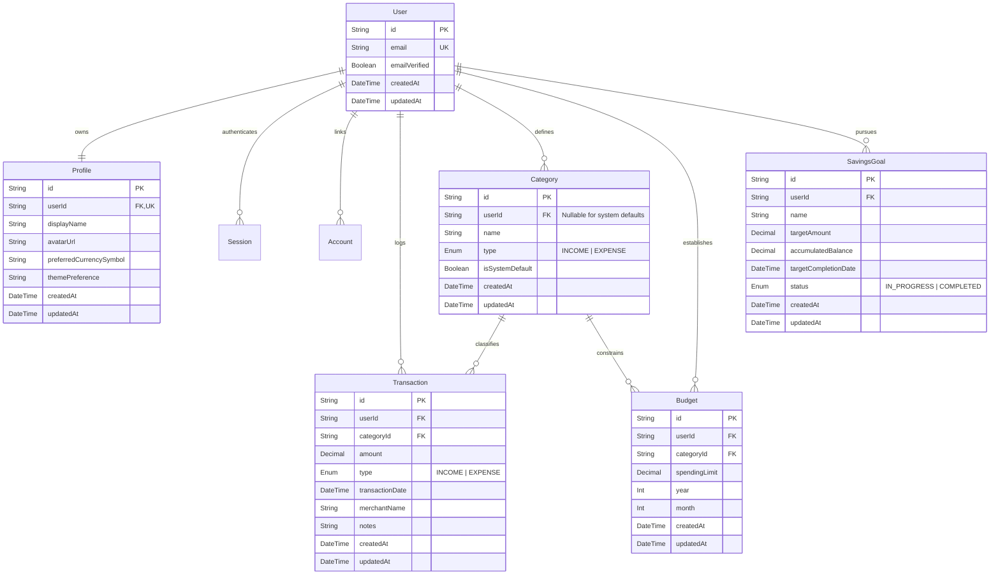
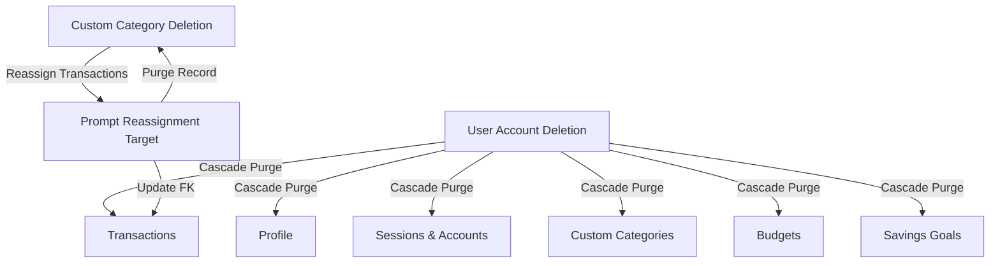

# Logical Database Design

## Application: Personal Finance Manager (v1.0 MVP)
**Role:** Database Architect & Senior Engineer  
**Status:** Approved Logical Database Design Specification  
**Traceability:** [product-requirements.md](file:///home/blart/Documents/webProjects/FinanceManager/docs/product-requirements.md) | [business-rules-and-edge-cases.md](file:///home/blart/Documents/webProjects/FinanceManager/docs/business-rules-and-edge-cases.md) | [system-architecture.md](file:///home/blart/Documents/webProjects/FinanceManager/docs/system-architecture.md)

---

# 1. Database Goals

The logical database design for the Personal Finance Manager is crafted to achieve five primary database architecture goals:

1. **ACID Financial Ledger Integrity:** Ensure zero data corruption or loss across income and expense transaction records ([NFR Reliability](file:///home/blart/Documents/webProjects/FinanceManager/docs/product-requirements.md#L171)).
2. **Exact Monetary Precision:** Eliminate floating-point rounding errors by enforcing fixed-point `DECIMAL(12, 2)` types for all monetary fields.
3. **Strict Multi-Tenant Row Isolation:** Guarantee that authenticated users can access only their owned financial data through mandatory foreign key linkages ([BR-008](file:///home/blart/Documents/webProjects/FinanceManager/docs/business-rules.md#L45)).
4. **Hard-Purge Compliance:** Support complete, permanent data erasure upon user account deletion ([BR-019](file:///home/blart/Documents/webProjects/FinanceManager/docs/business-rules.md#L106), [UC-014](file:///home/blart/Documents/webProjects/FinanceManager/docs/use-cases.md#L169)).
5. **High-Performance Aggregations:** Optimize B-Tree indexing to ensure dynamic balance and budget calculations load within 2 seconds under normal conditions ([FR-010](file:///home/blart/Documents/webProjects/FinanceManager/docs/product-requirements.md#L57), [NFR Performance](file:///home/blart/Documents/webProjects/FinanceManager/docs/product-requirements.md#L163)).

---

# 2. Database Design Principles

* **Third Normal Form (3NF) Standard:** Normalize data entities to eliminate update anomalies and data duplication.
* **Declarative Integrity Constraints:** Enforce domain rules (uniqueness, mandatory fields, check constraints) at the database layer.
* **UTC Timestamp Normalization:** Store all temporal attributes using UTC (`TIMESTAMPTZ` / `DateTime`) ([BR-012](file:///home/blart/Documents/webProjects/FinanceManager/docs/business-rules.md#L69)).
* **Single Currency Nominal Storage:** Store currency amounts as nominal values, relying on user profile preferences for visual display symbol formatting ([BR-018](file:///home/blart/Documents/webProjects/FinanceManager/docs/business-rules.md#L100)).

---

# 3. Entity-Relationship Model & Model Specifications

### 3.1 Model Responsibilities & Attributes

#### 1. `User` (Core Identity & Auth Model)
* **Purpose:** Represents an authenticated user account managed via Better Auth.
* **Key Attributes:** `id` (PK, CUID/UUID), `email` (UK, Case-insensitive string), `emailVerified` (Boolean), `createdAt`, `updatedAt`.
* **Responsibilities:** Anchors multi-tenant data ownership ([BR-008](file:///home/blart/Documents/webProjects/FinanceManager/docs/business-rules.md#L45)).

#### 2. `Profile` (User Visual & Display Preferences)
* **Purpose:** Stores user display preferences and visual settings.
* **Key Attributes:** `id` (PK), `userId` (FK, UK), `displayName` (String), `avatarUrl` (Nullable String), `preferredCurrencySymbol` (String, default `"$"`), `themePreference` (String, default `"dark"`).
* **Responsibilities:** Houses global visual currency prefix formatting ([BR-018](file:///home/blart/Documents/webProjects/FinanceManager/docs/business-rules.md#L100)) and theme state ([FR-063](file:///home/blart/Documents/webProjects/FinanceManager/docs/product-requirements.md#L312)).

#### 3. `Category` (Taxonomic Classification)
* **Purpose:** Classifies transactions and budgets into Income or Expense categories.
* **Key Attributes:** `id` (PK), `userId` (Nullable FK), `name` (String), `type` (Enum: `INCOME`, `EXPENSE`), `isSystemDefault` (Boolean, default `false`).
* **Responsibilities:** Differentiates between read-only system defaults (`isSystemDefault = true`, `userId = NULL`, [BR-017](file:///home/blart/Documents/webProjects/FinanceManager/docs/business-rules.md#L94)) and custom categories (`userId = FK`).

#### 4. `Transaction` (Financial Cashflow Ledger)
* **Purpose:** Records historical, current, and backdated income and expense movements.
* **Key Attributes:** `id` (PK), `userId` (FK), `categoryId` (FK), `amount` (Decimal(12,2)), `type` (Enum: `INCOME`, `EXPENSE`), `transactionDate` (DateTime UTC), `merchantName` (Nullable String), `notes` (Nullable String).
* **Responsibilities:** Serves as the primary immutable ledger driving cumulative net balance ([BR-020](file:///home/blart/Documents/webProjects/FinanceManager/docs/business-rules.md#L112)) and dynamic recalculations ([BR-006](file:///home/blart/Documents/webProjects/FinanceManager/docs/business-rules.md#L32)).

#### 5. `Budget` (Monthly Category Spending Limit)
* **Purpose:** Enforces category spending ceilings for a specific calendar month ([BR-014](file:///home/blart/Documents/webProjects/FinanceManager/docs/business-rules.md#L81)).
* **Key Attributes:** `id` (PK), `userId` (FK), `categoryId` (FK), `spendingLimit` (Decimal(12,2)), `year` (Int), `month` (Int, 1–12).
* **Responsibilities:** Monitors expenditure against limits to trigger 80% approach and 100%+ overrun warnings ([FR-044](file:///home/blart/Documents/webProjects/FinanceManager/docs/product-requirements.md#L238)).

#### 6. `SavingsGoal` (Target Savings Accumulation)
* **Purpose:** Manages financial savings targets and progress tracking.
* **Key Attributes:** `id` (PK), `userId` (FK), `name` (String), `targetAmount` (Decimal(12,2)), `accumulatedBalance` (Decimal(12,2), default `0.00`), `targetCompletionDate` (DateTime UTC), `status` (Enum: `IN_PROGRESS`, `COMPLETED`).
* **Responsibilities:** Tracks incremental savings contributions ([BR-016](file:///home/blart/Documents/webProjects/FinanceManager/docs/business-rules.md#L88)) and manages completion transitions ([FR-055](file:///home/blart/Documents/webProjects/FinanceManager/docs/product-requirements.md#L282)).

---

# 4. Data Integrity Rules & Constraints

| Constraint Type | Target Model / Attributes | Business Policy & Enforcement |
| :--- | :--- | :--- |
| **Unique Email** | `User.email` | Enforces unique email address across all accounts ([BR-001](file:///home/blart/Documents/webProjects/FinanceManager/docs/business-rules.md#L3)). |
| **Unique Profile** | `Profile.userId` | Guarantees a 1:1 relationship between User and Profile. |
| **Unique Custom Category** | `Category(userId, name, type)` | Prevents duplicate category names per user per type ([EC-008](file:///home/blart/Documents/webProjects/FinanceManager/docs/business-rules-and-edge-cases.md#L123)). |
| **Unique Monthly Budget** | `Budget(userId, categoryId, year, month)` | Enforces one budget per category per calendar month ([BR-014](file:///home/blart/Documents/webProjects/FinanceManager/docs/business-rules.md#L81)). |
| **Positive Amount Check** | `Transaction.amount` | Amount must be strictly > 0.00 ([BR-004](file:///home/blart/Documents/webProjects/FinanceManager/docs/business-rules.md#L17)). |
| **Positive Target Check** | `SavingsGoal.targetAmount` | Target amount must be strictly > 0.00 ([BR-009](file:///home/blart/Documents/webProjects/FinanceManager/docs/business-rules.md#L48)). |
| **Month Range Check** | `Budget.month` | Value must be between 1 and 12. |

---

# 5. Delete Behaviors & Referential Actions

* **User Account Deletion (`onDelete: Cascade`):** Deleting a user account permanently purges all profile data, sessions, transactions, custom categories, monthly budgets, and savings goals ([BR-019](file:///home/blart/Documents/webProjects/FinanceManager/docs/business-rules.md#L106)).
* **Category Deletion (`onDelete: Restrict` / Reassignment Flow):** Direct database cascading deletion on `Category ➔ Transaction` is **disabled**. Custom category deletion requires reassigning existing transactions to another active category or system "Uncategorized" default ([BR-013](file:///home/blart/Documents/webProjects/FinanceManager/docs/business-rules.md#L73), [FR-035](file:///home/blart/Documents/webProjects/FinanceManager/docs/product-requirements.md#L201)).

---

# 6. Indexing Strategy

To guarantee dashboard load performance under 2 seconds ([NFR Performance](file:///home/blart/Documents/webProjects/FinanceManager/docs/product-requirements.md#L163)):

| Table | Index Columns | Index Type | Query Optimization Target |
| :--- | :--- | :--- | :--- |
| `Transaction` | `(userId, transactionDate DESC)` | B-Tree | Optimizes main ledger feeds, recent activity lists, and date filtering ([FR-014](file:///home/blart/Documents/webProjects/FinanceManager/docs/product-requirements.md#L85)). |
| `Transaction` | `(userId, categoryId, transactionDate)` | B-Tree | Accelerates dynamic monthly category expenditure calculations for budget monitoring ([BR-007](file:///home/blart/Documents/webProjects/FinanceManager/docs/business-rules.md#L20)). |
| `Transaction` | `(userId, type, amount)` | B-Tree | Optimizes Net Balance dynamic aggregation queries (`SUM(Income) - SUM(Expense)`, [BR-020](file:///home/blart/Documents/webProjects/FinanceManager/docs/business-rules.md#L112)). |
| `Budget` | `(userId, categoryId, year, month)` | Composite Unique | Provides instantaneous budget lookup per category per month. |
| `Category` | `(userId, isSystemDefault, type)` | B-Tree | Speeds up category select lists during transaction logging ([FR-025](file:///home/blart/Documents/webProjects/FinanceManager/docs/product-requirements.md#L136)). |
| `SavingsGoal` | `(userId, targetCompletionDate)` | B-Tree | Optimizes savings goal progress tracking views ([FR-053](file:///home/blart/Documents/webProjects/FinanceManager/docs/product-requirements.md#L268)). |

---

# 7. Data Ownership & Multi-Tenant Isolation

* **Strict Row-Level Ownership:** Every table except pre-seeded system categories includes a mandatory `userId` foreign key.
* **Repository Enforcement:** Data access methods inject the authenticated `userId` into every Prisma query predicate, rendering cross-tenant data access impossible ([BR-008](file:///home/blart/Documents/webProjects/FinanceManager/docs/business-rules.md#L45)).

---

# 8. Future Extensibility & Design Rationale

* **Future Multi-Currency Support (v2.0):** The `Transaction` table can accommodate optional `originalAmount` and `exchangeRate` columns in future releases without breaking the v1.0 nominal decimal structure.
* **Future Bank Sync Integration (v2.0):** An optional `externalTransactionId` column can be added to `Transaction` to link automatically imported bank transactions.
* **Design Rationale:** Normalizing categories into a dedicated table rather than using raw strings ensures seamless category editing, custom user categories, and budget constraint enforcement.
