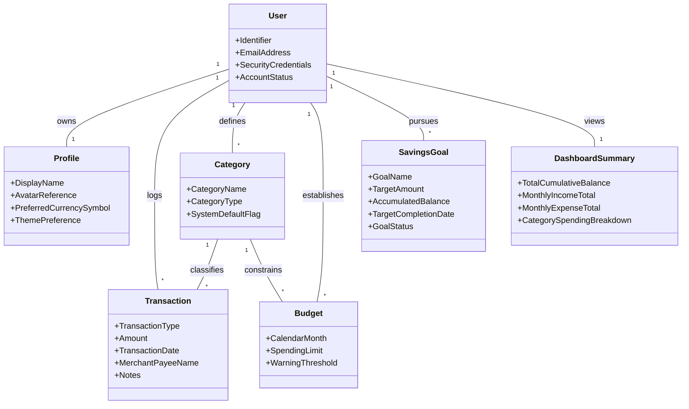
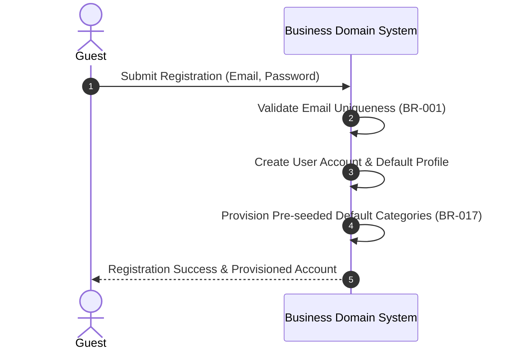
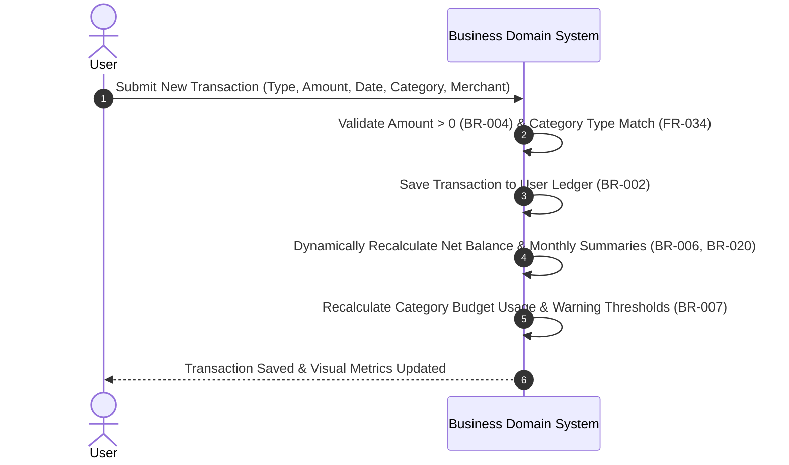
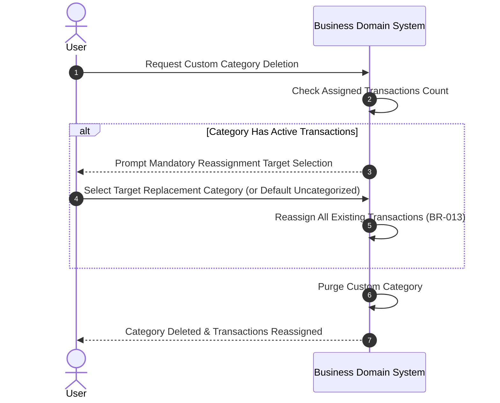
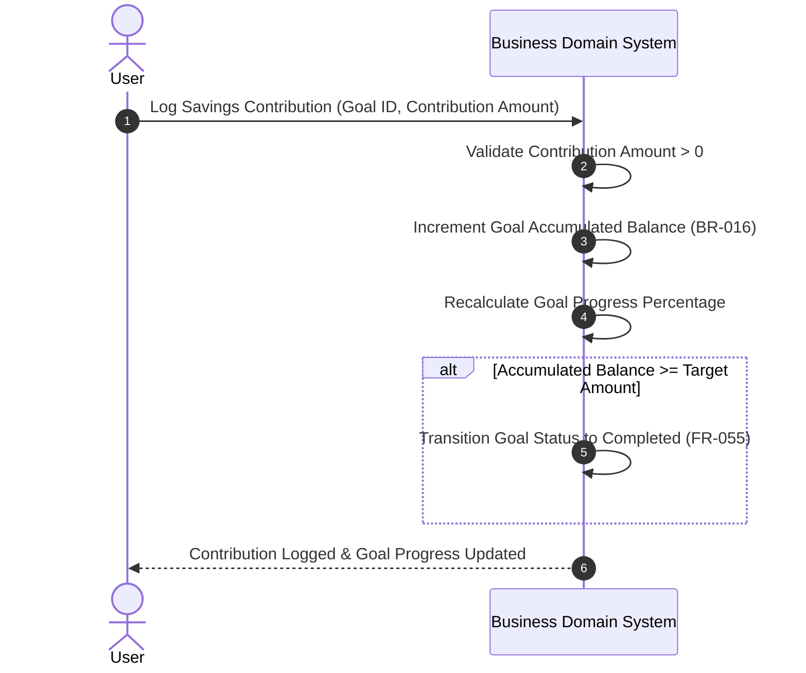
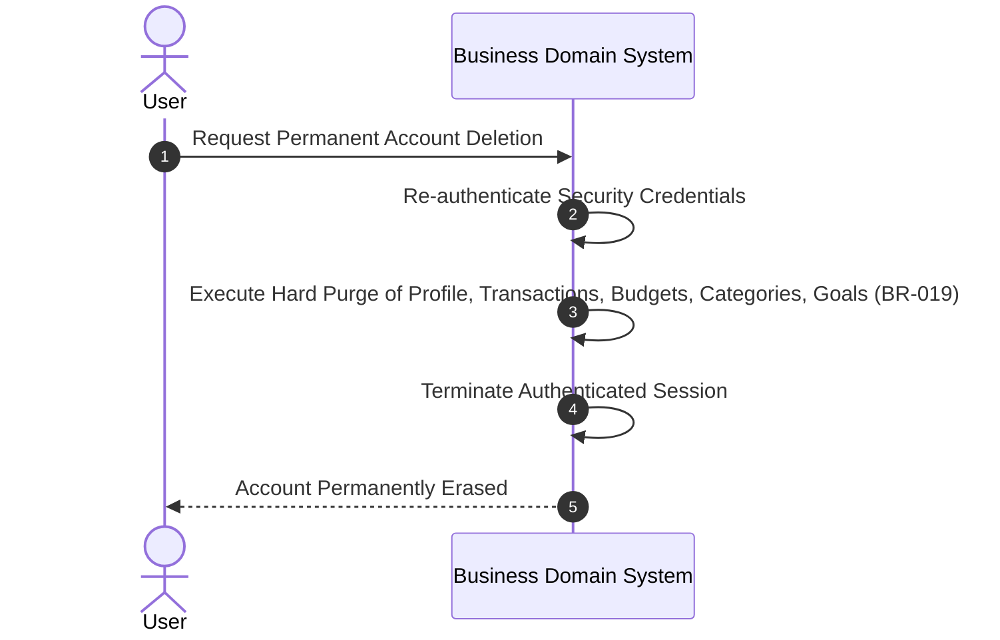

# Domain Analysis

## Application: Personal Finance Manager
**Role:** Senior Business Analyst & Domain Expert  
**Status:** Single Source of Truth for Business Domain  
**Traceability:** [product-vision.md](file:///home/blart/Documents/webProjects/FinanceManager/docs/product-vision.md) | [product-requirements.md](file:///home/blart/Documents/webProjects/FinanceManager/docs/product-requirements.md) | [business-rules.md](file:///home/blart/Documents/webProjects/FinanceManager/docs/business-rules.md) | [scope.md](file:///home/blart/Documents/webProjects/FinanceManager/docs/scope.md)

---

# 1. Domain Overview

Personal Finance Management is the process of planning, tracking, organizing, and evaluating individual monetary resources. The core domain centers around personal cash flow management, categorized financial record-keeping, monthly budget enforcement, and long-term capital accumulation (savings targets).

### Core Business Operations
1. **Cash Flow Management (Ledgering):** Individuals capture monetary movements classified into **Income** (earnings, allowances, dividends) and **Expense** (outflows for goods, services, housing, utilities).
2. **Taxonomic Organization (Categorization):** Transactions are mapped to standard or custom categories to provide structural clarity over spending patterns and earnings channels.
3. **Periodical Financial Control (Budgeting):** Users set maximum allowable spending limits per category for a specific calendar month window, monitoring usage in real time to prevent overspending.
4. **Capital Target Accumulation (Savings Goals):** Users establish named financial milestone targets (e.g., Emergency Fund, Vacation) with fixed completion dates, tracking incremental contributions over time.
5. **Financial Health Evaluation (Dashboard Analytics):** Aggregated metrics convert raw transactional records into actionable insights, showing net balance, monthly operational cash flow, category breakdowns, and goal progress.

---

# 2. Domain Entities

The personal finance management domain consists of seven primary business entities:

### 2.1 User
* **Purpose:** Represents the authenticated owner of a personal financial portfolio.
* **Responsibilities:** Holds identity credentials, enforces privacy boundaries ([BR-008](file:///home/blart/Documents/webProjects/FinanceManager/docs/business-rules.md#L45)), and anchors all personal financial records.
* **Relationships:**
  * Has a 1:1 relationship with **Profile**.
  * Has a 1:N relationship with **Transaction**, **Category**, **Budget**, and **Savings Goal**.
* **Lifecycle / States:** `Unregistered` ➔ `Active` ➔ `Purged` ([BR-019](file:///home/blart/Documents/webProjects/FinanceManager/docs/business-rules.md#L106)).

### 2.2 Profile
* **Purpose:** Holds user-specific display preferences and visual personalization settings.
* **Responsibilities:** Stores display name, avatar reference, theme preference, and global preferred currency display symbol ([BR-018](file:///home/blart/Documents/webProjects/FinanceManager/docs/business-rules.md#L100)).
* **Relationships:** Belongs to exactly 1 **User**.
* **Lifecycle / States:** `Active` (updated dynamically).

### 2.3 Transaction
* **Purpose:** Represents an individual historical monetary movement (inflow or outflow).
* **Responsibilities:** Records financial amount, type (`Income`/`Expense`), date, merchant/payee name, category assignment, and optional descriptive notes.
* **Relationships:**
  * Belongs to exactly 1 **User** ([BR-002](file:///home/blart/Documents/webProjects/FinanceManager/docs/business-rules.md#L11)).
  * Belongs to exactly 1 **Category** ([BR-003](file:///home/blart/Documents/webProjects/FinanceManager/docs/business-rules.md#L15)).
* **Lifecycle / States:** `Recorded` ➔ `Modified` ➔ `Deleted` (permanent purge, [BR-011](file:///home/blart/Documents/webProjects/FinanceManager/docs/business-rules.md#L63)).

### 2.4 Category
* **Purpose:** Provides a logical classification bucket for transactions and budgets.
* **Responsibilities:** Distinguishes between Income and Expense categories ([FR-034](file:///home/blart/Documents/webProjects/FinanceManager/docs/product-requirements.md#L194)); differentiates between read-only pre-seeded system defaults and user-created custom categories ([BR-017](file:///home/blart/Documents/webProjects/FinanceManager/docs/business-rules.md#L94)).
* **Relationships:**
  * Belongs to 1 **User** (or system-wide default).
  * Classifies 0..N **Transactions**.
  * Constrains 0..N **Budgets**.
* **Lifecycle / States:** `Active` ➔ `Reassigned/Deleted` ([BR-013](file:///home/blart/Documents/webProjects/FinanceManager/docs/business-rules.md#L73)).

### 2.5 Budget
* **Purpose:** Sets a monetary spending ceiling for a specific category over one calendar month ([BR-014](file:///home/blart/Documents/webProjects/FinanceManager/docs/business-rules.md#L81)).
* **Responsibilities:** Monitors real-time category expenditure against spending limits and signals visual threshold warnings ([FR-044](file:///home/blart/Documents/webProjects/FinanceManager/docs/product-requirements.md#L238)).
* **Relationships:** Bound to 1 **Category** for 1 specific **User** during 1 calendar month.
* **Lifecycle / States:** `Normal` (< 80%) ➔ `Approaching Limit` (80%–99%) ➔ `Exceeded` (≥ 100%).

### 2.6 Savings Goal
* **Purpose:** Captures an explicit financial savings objective with target target values and target deadlines ([FR-050](file:///home/blart/Documents/webProjects/FinanceManager/docs/product-requirements.md#L247)).
* **Responsibilities:** Tracks cumulative contributions, calculates progress percentages, and signals completion status ([FR-053](file:///home/blart/Documents/webProjects/FinanceManager/docs/product-requirements.md#L268), [BR-016](file:///home/blart/Documents/webProjects/FinanceManager/docs/business-rules.md#L88)).
* **Relationships:** Belongs to 1 **User**.
* **Lifecycle / States:** `In Progress` (< 100%) ➔ `Completed` (≥ 100%).

### 2.7 Dashboard Summary
* **Purpose:** Aggregates real-time financial metrics for immediate evaluation of user financial health ([FR-010](file:///home/blart/Documents/webProjects/FinanceManager/docs/product-requirements.md#L57)–[FR-015](file:///home/blart/Documents/webProjects/FinanceManager/docs/product-requirements.md#L92)).
* **Responsibilities:** Dynamically calculates total net balance, monthly income, monthly expenses, recent activity, and spending analytics ([BR-015](file:///home/blart/Documents/webProjects/FinanceManager/docs/business-rules.md#L86), [BR-020](file:///home/blart/Documents/webProjects/FinanceManager/docs/business-rules.md#L112)).
* **Relationships:** Derived view for 1 **User** computed from underlying **Transactions**, **Budgets**, and **Savings Goals**.

---

# 3. Business Workflows

### 3.1 User Registration Workflow

### 3.2 Add Transaction Workflow

### 3.3 Delete Category with Transaction Reassignment Workflow

### 3.4 Savings Goal Progress Update Workflow

### 3.5 Account Deletion Workflow

---

# 4. Domain Glossary

| Business Term | Definition |
| :--- | :--- |
| **Cumulative Net Balance** | The total net monetary position of a user calculated as all historical Income minus all historical Expenses ([BR-020](file:///home/blart/Documents/webProjects/FinanceManager/docs/business-rules.md#L112)). Can be positive or negative. |
| **Operational Cash Flow** | The net monthly total calculated as total income received minus total expenses incurred within a specific calendar month. |
| **Historical Backdating** | Recording or editing a transaction with an effective transaction date prior to the current calendar date ([FR-027](file:///home/blart/Documents/webProjects/FinanceManager/docs/product-requirements.md#L150)). Triggers retroactive summary updates ([BR-006](file:///home/blart/Documents/webProjects/FinanceManager/docs/business-rules.md#L32)). |
| **Pre-seeded Category** | Standard, system-provided read-only categories (e.g., Groceries, Salary) available to all users upon registration ([BR-017](file:///home/blart/Documents/webProjects/FinanceManager/docs/business-rules.md#L94)). |
| **Category Reassignment** | The business process of moving transactions from a category being deleted to an active target category or system "Uncategorized" default ([BR-013](file:///home/blart/Documents/webProjects/FinanceManager/docs/business-rules.md#L73)). |
| **Budget Threshold Warning** | Visual indicator triggered when category spending reaches defined limits: Yellow warning at 80%–99% (Approach) and Red warning at 100%+ (Exceeded) ([FR-044](file:///home/blart/Documents/webProjects/FinanceManager/docs/product-requirements.md#L238)). |
| **Contribution** | A monetary addition explicitly logged toward achieving a designated Savings Goal ([FR-054](file:///home/blart/Documents/webProjects/FinanceManager/docs/product-requirements.md#L275), [BR-016](file:///home/blart/Documents/webProjects/FinanceManager/docs/business-rules.md#L88)). |
| **Preferred Currency Symbol** | User-selected visual formatting prefix/suffix symbol (e.g., `$`, `€`, `£`, `¥`) applied globally to display financial amounts without exchange rate conversion ([BR-018](file:///home/blart/Documents/webProjects/FinanceManager/docs/business-rules.md#L100)). |
| **Hard Data Purging** | Permanent, non-recoverable deletion of user accounts and all dependent financial records ([BR-019](file:///home/blart/Documents/webProjects/FinanceManager/docs/business-rules.md#L106)). |

---

# 5. Business Assumptions

1. **Single Portfolio Model:** Each registered user account manages a single consolidated personal finance portfolio (multi-user shared budgets are out of scope for v1.0).
2. **Manual Entry Standard:** Transactions, category budgets, and savings contributions are recorded via user manual entry (automated bank synchronization is out of scope for v1.0).
3. **Symbolic Currency Formatting:** A user selects a single display currency symbol per account. Financial calculations treat all amounts as nominal values without performing foreign exchange rate conversions.
4. **UTC Timestamp Baseline:** All transaction dates and operational event logs are normalized using Coordinated Universal Time (UTC) to preserve temporal consistency ([BR-012](file:///home/blart/Documents/webProjects/FinanceManager/docs/business-rules.md#L69)).
5. **Calendar Month Budgeting:** Budgets strictly evaluate spending aligned with standard calendar months (1st day to last day of the month) rather than arbitrary rolling 30-day windows ([BR-014](file:///home/blart/Documents/webProjects/FinanceManager/docs/business-rules.md#L81)).
