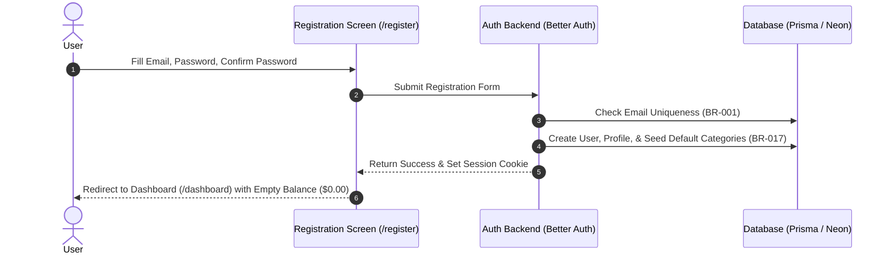
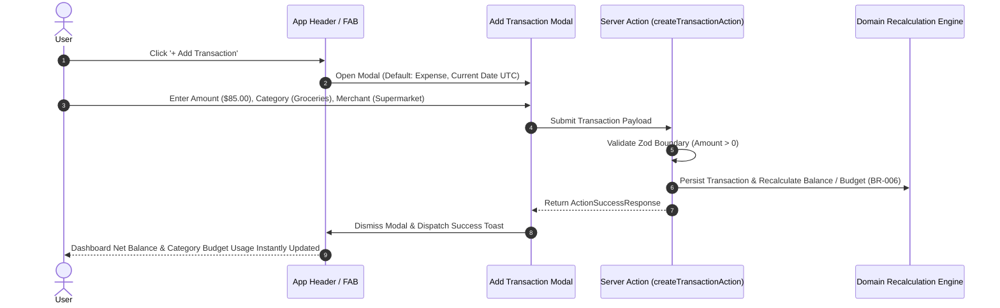
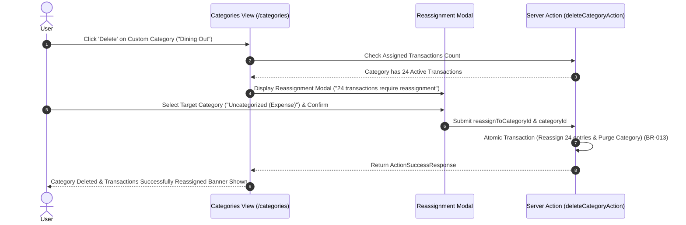
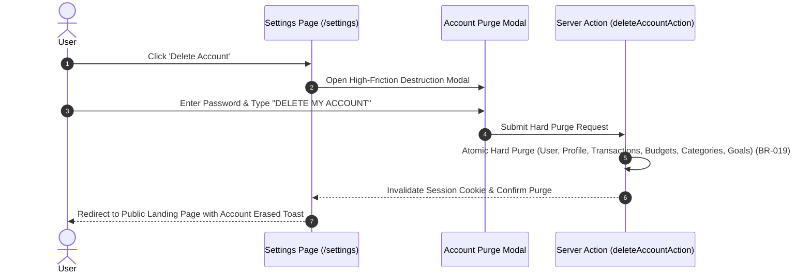

# Screen & User Flow Specifications

**Application:** Personal Finance Manager (v1.0 MVP)  
**Role:** Senior Product Designer & UX Architect  
**Status:** Authoritative Screen & Flow Blueprint  
**Traceability:** Implements requirements from [product-requirements.md](file:///home/blart/Documents/webProjects/FinanceManager/docs/product-requirements.md), [use-cases.md](file:///home/blart/Documents/webProjects/FinanceManager/docs/use-cases.md), [user-stories.md](file:///home/blart/Documents/webProjects/FinanceManager/docs/user-stories.md), [business-rules-and-edge-cases.md](file:///home/blart/Documents/webProjects/FinanceManager/docs/business-rules-and-edge-cases.md), and [backend-api-design.md](file:///home/blart/Documents/webProjects/FinanceManager/backend-api-design.md).

---

## 1. Executive Summary

This document defines the complete UI screen inventory and step-by-step user interaction flows for the **Personal Finance Manager**.

Every screen specification details layout structures, data displays, user actions, 5-state UI models (Loading, Ideal, Empty, Filtered, Error), responsive adaptations, accessibility compliance, and security authorization rules.

---

## 2. Complete Screen Inventory

---

### Screen 1: Registration (`/register`)
* **Purpose:** Enables guest visitors to create a secure new user account ([FR-001](file:///home/blart/Documents/webProjects/FinanceManager/docs/product-requirements.md#L13), [UC-001](file:///home/blart/Documents/webProjects/FinanceManager/docs/use-cases.md#L3)).
* **Primary User:** Guest Visitor.
* **Entry Points:** Direct URL `/register`, "Sign Up" link on Login screen.
* **Exit Points:** Dashboard Hub `/dashboard` (upon success), Login screen `/login`.
* **Layout Structure:** Centered single-card auth layout on branded slate background.
* **Main Content:** Application logo, tagline, Email field, Password field, Confirm Password field.
* **Primary Action:** `Create Account` button.
* **Secondary Action:** `Already have an account? Log in` text link.
* **Data Displayed:** None.
* **User Interactions:** Enters credentials, submits form. Enforces unique email check ([BR-001](file:///home/blart/Documents/webProjects/FinanceManager/docs/business-rules.md#L3)).
* **Loading State:** Button displays spinner and disables input fields.
* **Empty State:** N/A.
* **Error State:** Displays inline field validation errors (e.g. *"Email address is already registered"* or *"Passwords do not match"*).
* **Success State:** Dispatches confirmation toast and redirects immediately to `/dashboard` with pre-seeded categories ready ([BR-017](file:///home/blart/Documents/webProjects/FinanceManager/docs/business-rules.md#L94)).
* **Authorization:** Public access only.
* **Responsive Behavior:** Full-width card with padding on mobile; fixed 400px width card on desktop.
* **Accessibility:** `aria-describedby` links inputs to error messages; full keyboard tab traversal.

---

### Screen 2: Login (`/login`)
* **Purpose:** Authenticates returning users into their private financial portfolio ([FR-002](file:///home/blart/Documents/webProjects/FinanceManager/docs/product-requirements.md#L20), [UC-002](file:///home/blart/Documents/webProjects/FinanceManager/docs/use-cases.md#L16)).
* **Primary User:** Registered User.
* **Entry Points:** Direct URL `/login`, Session timeout redirect.
* **Exit Points:** Dashboard `/dashboard` (on success), `/forgot-password`.
* **Layout Structure:** Centered single-card auth layout.
* **Main Content:** Email field, Password field, "Remember me" checkbox ([FR-005](file:///home/blart/Documents/webProjects/FinanceManager/docs/product-requirements.md#L41)), Forgot Password link.
* **Primary Action:** `Sign In` button.
* **Secondary Action:** `Don't have an account? Register` link.
* **Error State:** Top-level alert banner: *"Invalid email or password credentials."*
* **Authorization:** Public access only.

---

### Screen 3: Password Reset Request & Confirmation (`/forgot-password`, `/reset-password`)
* **Purpose:** Dispatches security tokens via email to recover forgotten account access ([FR-004](file:///home/blart/Documents/webProjects/FinanceManager/docs/product-requirements.md#L34), [UC-011](file:///home/blart/Documents/webProjects/FinanceManager/docs/use-cases.md#L133)).
* **Primary User:** Guest / Registered User.
* **Primary Action:** `Send Reset Link` / `Update Password`.
* **Success State:** Displays confirmation message: *"Password reset email sent. Check your inbox."*

---

### Screen 4: Dashboard Hub (`/dashboard`)
* **Purpose:** Provides an immediate, aggregated overview of financial health, balance, cashflow, recent activity, and budget alerts ([FR-010](file:///home/blart/Documents/webProjects/FinanceManager/docs/product-requirements.md#L57)–[FR-015](file:///home/blart/Documents/webProjects/FinanceManager/docs/product-requirements.md#L92), [UC-007](file:///home/blart/Documents/webProjects/FinanceManager/docs/use-cases.md#L81)).
* **Primary User:** Authenticated User.
* **Entry Points:** Post-login default landing, Sidebar/Bottom nav click.
* **Exit Points:** Deep links to `/transactions`, `/budgets`, `/categories`, `/savings`, `/settings`.
* **Layout Structure:** 3-Column responsive dashboard grid (Desktop) / Single-column stack (Mobile).
* **Main Content:**
  1. **Header Bar:** Calendar Month Selector + `+ Add Transaction` Quick Button.
  2. **Net Account Balance Card:** Displays cumulative net balance ($\sum \text{Income} - \sum \text{Expense}$). Formatted in Rose red if negative (`-$250.00`) or Emerald green if positive (`+$1,250.00`) ([BR-020](file:///home/blart/Documents/webProjects/FinanceManager/docs/business-rules.md#L112)).
  3. **Monthly Cashflow Summary Cards:** Total Monthly Income vs. Total Monthly Expense.
  4. **Budget Warning Alert Bar:** Highlighting categories in Amber (80%+) or Crimson (100%+ overrun) ([FR-044](file:///home/blart/Documents/webProjects/FinanceManager/docs/product-requirements.md#L238)).
  5. **Recent Transactions Feed:** List of 5 most recent entries with merchant, category, date, and amount.
  6. **Spending Analytics Preview:** Recharts expense breakdown donut chart.
* **Primary Actions:** `+ Add Transaction` button, `View All Transactions` link.
* **Loading State:** Component-matched skeleton cards for balance, cashflow, and recent feed.
* **Empty State (New Account):** Balance displays `$0.00`. Feed displays prompt: *"No financial activity logged yet."* with primary `+ Add First Transaction` CTA ([EC-001](file:///home/blart/Documents/webProjects/FinanceManager/docs/business-rules-and-edge-cases.md#L116)).
* **Authorization:** Scoped strictly to session `userId` ([BR-008](file:///home/blart/Documents/webProjects/FinanceManager/docs/business-rules.md#L45)).

---

### Screen 5: Transactions Ledger (`/transactions`)
* **Purpose:** Search, filter, inspect, edit, and delete financial ledger entries ([FR-020](file:///home/blart/Documents/webProjects/FinanceManager/docs/product-requirements.md#L101)–[FR-027](file:///home/blart/Documents/webProjects/FinanceManager/docs/product-requirements.md#L150)).
* **Primary User:** Authenticated User.
* **Main Content:**
  1. **Search & Filter Toolbar:** Search input (matches merchant or notes), Type filter dropdown (`All`, `Income`, `Expense`), Category filter dropdown, Date Range picker.
  2. **Ledger View:** Data Table with headers: `Date`, `Type`, `Category`, `Merchant/Payee`, `Notes`, `Amount`, `Actions` (Desktop) / Expandable Cards (Mobile).
* **User Interactions:** Clicking edit opens Transaction Modal with backdating support ([FR-027](file:///home/blart/Documents/webProjects/FinanceManager/docs/product-requirements.md#L150)). Clicking delete triggers confirmation dialog ([BR-011](file:///home/blart/Documents/webProjects/FinanceManager/docs/business-rules.md#L65)).
* **Filtered Empty State:** Displays *"No transactions match your filter criteria."* with `Clear Filters` button.

---

### Screen 6: Category Management (`/categories`)
* **Purpose:** Organize custom categories and manage default categories ([FR-030](file:///home/blart/Documents/webProjects/FinanceManager/docs/product-requirements.md#L166)–[FR-035](file:///home/blart/Documents/webProjects/FinanceManager/docs/product-requirements.md#L201), [UC-012](file:///home/blart/Documents/webProjects/FinanceManager/docs/use-cases.md#L145)).
* **Main Content:**
  1. **Type Tabs:** `Expense Categories` (Default) vs `Income Categories`.
  2. **System Default Categories Section:** Read-only badges (`isSystemDefault = true`, [BR-017](file:///home/blart/Documents/webProjects/FinanceManager/docs/business-rules.md#L94)).
  3. **Custom Categories Grid:** Editable category cards with transaction count indicators.
* **Key Interaction (Category Deletion):** Clicking delete on a category containing active transactions opens the mandatory **Category Reassignment Modal** ([BR-013](file:///home/blart/Documents/webProjects/FinanceManager/docs/business-rules.md#L73)). User selects replacement category (e.g. `"Uncategorized"`) to complete deletion.

---

### Screen 7: Monthly Budgets (`/budgets`)
* **Purpose:** Establish and monitor category spending ceilings per calendar month ([FR-040](file:///home/blart/Documents/webProjects/FinanceManager/docs/product-requirements.md#L210)–[FR-044](file:///home/blart/Documents/webProjects/FinanceManager/docs/product-requirements.md#L238), [UC-006](file:///home/blart/Documents/webProjects/FinanceManager/docs/use-cases.md#L68)).
* **Main Content:** Calendar Month Selector, Overall Budget Usage Bar, Category Budget Cards Grid.
* **Card Display:** Category Name, Spending Limit, Actual Spent, Remaining Balance, Progress Bar.
* **Warning Badges:**
  - $80\% \le \text{Usage} < 100\%$: Amber Bar + `AlertTriangle` + `"Approaching Limit"` badge.
  - $\text{Usage} \ge 100\%$: Crimson Bar + `AlertOctagon` + `"Budget Exceeded"` alert badge.

---

### Screen 8: Savings Goals (`/savings`)
* **Purpose:** Track financial milestones and log incremental contributions ([FR-050](file:///home/blart/Documents/webProjects/FinanceManager/docs/product-requirements.md#L247)–[FR-055](file:///home/blart/Documents/webProjects/FinanceManager/docs/product-requirements.md#L282), [UC-008](file:///home/blart/Documents/webProjects/FinanceManager/docs/use-cases.md#L94), [UC-013](file:///home/blart/Documents/webProjects/FinanceManager/docs/use-cases.md#L157)).
* **Main Content:** Goals Grid, Target Amount, Accumulated Balance, Remaining Balance, Target Completion Date, Progress Percentage Bar/Ring.
* **Key Interaction:** Clicking `+ Record Contribution` opens contribution modal. Submitting increments `accumulatedBalance` ([BR-016](file:///home/blart/Documents/webProjects/FinanceManager/docs/business-rules.md#L88)). If 100% reached, displays `COMPLETED` badge.

---

### Screen 9: Analytics & Trends (`/analytics`)
* **Purpose:** Visual historical cash flow trends and category spending distribution ([FR-015](file:///home/blart/Documents/webProjects/FinanceManager/docs/product-requirements.md#L92)).
* **Main Content:** Interactive Recharts Category Donut Chart, Income vs. Expense Bar Chart, Timeframe Selector.

---

### Screen 10: Settings & Profile (`/settings`)
* **Purpose:** Manage user profile, currency display preferences, theme toggle, and account deletion ([FR-060](file:///home/blart/Documents/webProjects/FinanceManager/docs/product-requirements.md#L291)–[FR-063](file:///home/blart/Documents/webProjects/FinanceManager/docs/product-requirements.md#L312), [UC-009](file:///home/blart/Documents/webProjects/FinanceManager/docs/use-cases.md#L107), [UC-014](file:///home/blart/Documents/webProjects/FinanceManager/docs/use-cases.md#L169)).
* **Main Content:** Display Name & Email form, Preferred Currency Symbol dropdown (`$`, `€`, `£`, `¥`), Light/Dark Mode toggle, `Delete Account` destructive section.

---

## 3. Major Step-by-Step User Flows

### Flow 1: Registration & Initial Onboarding

---

### Flow 2: Quick Transaction Creation & Dynamic Recalculation

---

### Flow 3: Custom Category Deletion with Mandatory Reassignment

---

### Flow 4: Permanent Account Deletion (Hard Purge)

---

## 4. Requirement Traceability Matrix

| Screen / Flow ID | Target Screen / Flow | Primary Requirement Traceability | Verification Status |
| :--- | :--- | :--- | :--- |
| **SCR-01** | Registration Screen | [FR-001](file:///home/blart/Documents/webProjects/FinanceManager/docs/product-requirements.md#L13), [UC-001](file:///home/blart/Documents/webProjects/FinanceManager/docs/use-cases.md#L3), [BR-001](file:///home/blart/Documents/webProjects/FinanceManager/docs/business-rules.md#L3) | ✅ Verified |
| **SCR-02** | Login Screen | [FR-002](file:///home/blart/Documents/webProjects/FinanceManager/docs/product-requirements.md#L20), [UC-002](file:///home/blart/Documents/webProjects/FinanceManager/docs/use-cases.md#L16) | ✅ Verified |
| **SCR-03** | Password Reset Screens | [FR-004](file:///home/blart/Documents/webProjects/FinanceManager/docs/product-requirements.md#L34), [UC-011](file:///home/blart/Documents/webProjects/FinanceManager/docs/use-cases.md#L133) | ✅ Verified |
| **SCR-04** | Dashboard Hub | [FR-010](file:///home/blart/Documents/webProjects/FinanceManager/docs/product-requirements.md#L57)–[FR-015](file:///home/blart/Documents/webProjects/FinanceManager/docs/product-requirements.md#L92), [UC-007](file:///home/blart/Documents/webProjects/FinanceManager/docs/use-cases.md#L81), [BR-020](file:///home/blart/Documents/webProjects/FinanceManager/docs/business-rules.md#L112) | ✅ Verified |
| **SCR-05** | Transactions Ledger | [FR-020](file:///home/blart/Documents/webProjects/FinanceManager/docs/product-requirements.md#L101)–[FR-027](file:///home/blart/Documents/webProjects/FinanceManager/docs/product-requirements.md#L150), [UC-003](file:///home/blart/Documents/webProjects/FinanceManager/docs/use-cases.md#L29)–[UC-005](file:///home/blart/Documents/webProjects/FinanceManager/docs/use-cases.md#L55) | ✅ Verified |
| **SCR-06** | Category Management | [FR-030](file:///home/blart/Documents/webProjects/FinanceManager/docs/product-requirements.md#L166)–[FR-035](file:///home/blart/Documents/webProjects/FinanceManager/docs/product-requirements.md#L201), [UC-012](file:///home/blart/Documents/webProjects/FinanceManager/docs/use-cases.md#L145), [BR-013](file:///home/blart/Documents/webProjects/FinanceManager/docs/business-rules.md#L73) | ✅ Verified |
| **SCR-07** | Monthly Budgets | [FR-040](file:///home/blart/Documents/webProjects/FinanceManager/docs/product-requirements.md#L210)–[FR-044](file:///home/blart/Documents/webProjects/FinanceManager/docs/product-requirements.md#L238), [UC-006](file:///home/blart/Documents/webProjects/FinanceManager/docs/use-cases.md#L68), [BR-014](file:///home/blart/Documents/webProjects/FinanceManager/docs/business-rules.md#L81) | ✅ Verified |
| **SCR-08** | Savings Goals | [FR-050](file:///home/blart/Documents/webProjects/FinanceManager/docs/product-requirements.md#L247)–[FR-055](file:///home/blart/Documents/webProjects/FinanceManager/docs/product-requirements.md#L282), [UC-008](file:///home/blart/Documents/webProjects/FinanceManager/docs/use-cases.md#L94), [UC-013](file:///home/blart/Documents/webProjects/FinanceManager/docs/use-cases.md#L157) | ✅ Verified |
| **SCR-09** | Analytics & Trends | [FR-015](file:///home/blart/Documents/webProjects/FinanceManager/docs/product-requirements.md#L92) | ✅ Verified |
| **SCR-10** | Settings & Profile | [FR-060](file:///home/blart/Documents/webProjects/FinanceManager/docs/product-requirements.md#L291)–[FR-063](file:///home/blart/Documents/webProjects/FinanceManager/docs/product-requirements.md#L312), [UC-009](file:///home/blart/Documents/webProjects/FinanceManager/docs/use-cases.md#L107), [UC-014](file:///home/blart/Documents/webProjects/FinanceManager/docs/use-cases.md#L169), [BR-019](file:///home/blart/Documents/webProjects/FinanceManager/docs/business-rules.md#L106) | ✅ Verified |
