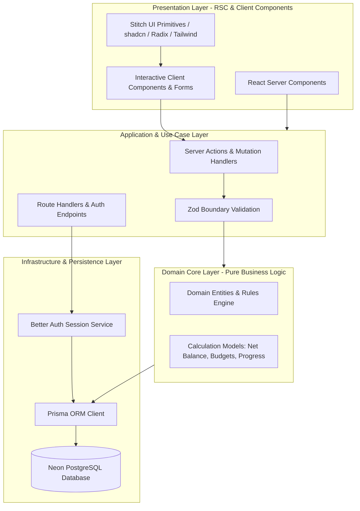
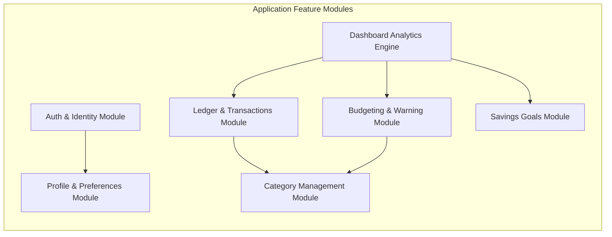
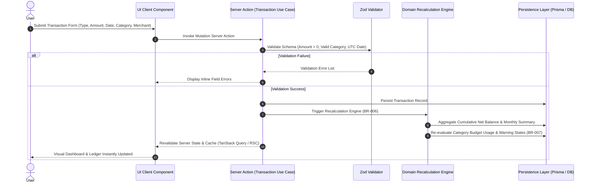

# Master System Architecture Document

## Application: Personal Finance Manager (v1.0 MVP)
**Role:** Principal Software Architect  
**Status:** Master Technical Architecture Blueprint  
**Traceability:** [product-vision.md](file:///home/blart/Documents/webProjects/FinanceManager/docs/product-vision.md) | [product-requirements.md](file:///home/blart/Documents/webProjects/FinanceManager/docs/product-requirements.md) | [domain-analysis.md](file:///home/blart/Documents/webProjects/FinanceManager/docs/domain-analysis.md) | [business-rules-and-edge-cases.md](file:///home/blart/Documents/webProjects/FinanceManager/docs/business-rules-and-edge-cases.md)

---

# 1. Architecture Goals

The software architecture for Personal Finance Manager is designed to achieve the following core technical goals:

1. **Faithful Requirement Realization:** Directly translate all functional requirements ([FR-001](file:///home/blart/Documents/webProjects/FinanceManager/docs/product-requirements.md#L13)–[FR-063](file:///home/blart/Documents/webProjects/FinanceManager/docs/product-requirements.md#L312)) and business rules ([BR-001](file:///home/blart/Documents/webProjects/FinanceManager/docs/business-rules.md#L3)–[BR-020](file:///home/blart/Documents/webProjects/FinanceManager/docs/business-rules.md#L112)) into robust, testable software modules.
2. **High Maintainability for a Solo Developer:** Structure the codebase cleanly so a single developer can easily navigate, update, and extend features without cognitive overload.
3. **Optimized AI Tool Collaboration:** Establish strict component interfaces, modular boundaries, and predictable directory structures optimized for AI-driven development workflows (**Stitch** for UI design, **Antigravity CLI** for execution, **Gemini** for code reviews).
4. **Performance Efficiency:** Achieve dashboard and page load times under 2 seconds under normal conditions by leveraging server-side rendering and efficient database aggregations.
5. **Strict Data Isolation & Security:** Enforce multi-tenant user data boundaries ([BR-008](file:///home/blart/Documents/webProjects/FinanceManager/docs/business-rules.md#L45)) and complete hard-purge data erasure ([BR-019](file:///home/blart/Documents/webProjects/FinanceManager/docs/business-rules.md#L106)).

---

# 2. Architectural Style & Justification

The system adopts a **Modular Clean Architecture (Feature-Sliced Layered Architecture)** natively mapped onto the **Next.js App Router** framework.



### Architectural Layer Responsibilities
* **Presentation Layer:** Contains UI page layouts, views, and visual components. Utilizes React Server Components (RSC) for initial data fetching and Client Components for interactive forms and charts. Components are designed to accept pure typed props matching **Stitch UI** design outputs.
* **Application / Use Case Layer:** Orchestrates business workflows (Register, Log Transaction, Edit Budget, etc.), validates input data via Zod schemas, and handles session authorization checks before executing domain logic.
* **Domain Core Layer:** Pure TypeScript domain models, mathematical formulas (Net Balance, Monthly Cash Flow, Budget Threshold Warning state machines), and business rules. Completely independent of UI frameworks and database drivers.
* **Infrastructure / Persistence Layer:** Handles external dependencies including Prisma ORM for relational PostgreSQL persistence, Better Auth for session management, and transactional email dispatch.

### Justification for Selected Architectural Style
* **Decoupling UI from Business Rules:** Prevents presentation components from containing inline database calls or business logic, allowing Stitch UI designs to be updated without breaking core domain logic.
* **Predictable Boundaries for AI Collaboration:** High cohesion within feature slices enables AI tools to edit specific features (e.g. `features/budgets`) without risking unintended side effects across unrelated modules.

---

# 3. High-Level System Overview & Major Modules

The system is organized into 7 functional modules:



### 3.1 Module Breakdown & Responsibilities

#### 1. Auth & Identity Module (`modules/auth`)
* **Responsibilities:** Manages user registration ([FR-001](file:///home/blart/Documents/webProjects/FinanceManager/docs/product-requirements.md#L13)), login session authentication ([FR-002](file:///home/blart/Documents/webProjects/FinanceManager/docs/product-requirements.md#L20)), secure logout ([FR-003](file:///home/blart/Documents/webProjects/FinanceManager/docs/product-requirements.md#L27)), transactional email password reset ([FR-004](file:///home/blart/Documents/webProjects/FinanceManager/docs/product-requirements.md#L34)), session persistence ([FR-005](file:///home/blart/Documents/webProjects/FinanceManager/docs/product-requirements.md#L41)), and permanent account hard purging ([FR-006](file:///home/blart/Documents/webProjects/FinanceManager/docs/product-requirements.md#L48), [BR-019](file:///home/blart/Documents/webProjects/FinanceManager/docs/business-rules.md#L106)).

#### 2. Profile & Preferences Module (`modules/profile`)
* **Responsibilities:** Manages user display profile information ([FR-060](file:///home/blart/Documents/webProjects/FinanceManager/docs/product-requirements.md#L291)), profile picture avatar references ([FR-061](file:///home/blart/Documents/webProjects/FinanceManager/docs/product-requirements.md#L298)), preferred currency display symbol formatting ([FR-062](file:///home/blart/Documents/webProjects/FinanceManager/docs/product-requirements.md#L305), [BR-018](file:///home/blart/Documents/webProjects/FinanceManager/docs/business-rules.md#L100)), and light/dark theme state ([FR-063](file:///home/blart/Documents/webProjects/FinanceManager/docs/product-requirements.md#L312)).

#### 3. Ledger & Transactions Module (`modules/transactions`)
* **Responsibilities:** Manages Income and Expense transaction CRUD ([FR-020](file:///home/blart/Documents/webProjects/FinanceManager/docs/product-requirements.md#L101)–[FR-022](file:///home/blart/Documents/webProjects/FinanceManager/docs/product-requirements.md#L115)), date specification and historical backdating ([FR-027](file:///home/blart/Documents/webProjects/FinanceManager/docs/product-requirements.md#L150)), merchant/payee name recording, search and multi-filtering ([FR-023](file:///home/blart/Documents/webProjects/FinanceManager/docs/product-requirements.md#L122), [FR-024](file:///home/blart/Documents/webProjects/FinanceManager/docs/product-requirements.md#L129)), and triggers dynamic recalculations ([FR-028](file:///home/blart/Documents/webProjects/FinanceManager/docs/product-requirements.md#L157), [BR-006](file:///home/blart/Documents/webProjects/FinanceManager/docs/business-rules.md#L32)).

#### 4. Category Management Module (`modules/categories`)
* **Responsibilities:** Manages pre-seeded read-only default system categories ([FR-033](file:///home/blart/Documents/webProjects/FinanceManager/docs/product-requirements.md#L187), [BR-017](file:///home/blart/Documents/webProjects/FinanceManager/docs/business-rules.md#L94)), custom category CRUD ([FR-030](file:///home/blart/Documents/webProjects/FinanceManager/docs/product-requirements.md#L166)–[FR-032](file:///home/blart/Documents/webProjects/FinanceManager/docs/product-requirements.md#L180)), classification by type (`Income`/`Expense`, [FR-034](file:///home/blart/Documents/webProjects/FinanceManager/docs/product-requirements.md#L194)), and enforces mandatory transaction reassignment during category deletion ([FR-035](file:///home/blart/Documents/webProjects/FinanceManager/docs/product-requirements.md#L201), [BR-013](file:///home/blart/Documents/webProjects/FinanceManager/docs/business-rules.md#L73)).

#### 5. Budgeting & Warning Module (`modules/budgets`)
* **Responsibilities:** Controls monthly category budget limits ([FR-040](file:///home/blart/Documents/webProjects/FinanceManager/docs/product-requirements.md#L210)–[FR-042](file:///home/blart/Documents/webProjects/FinanceManager/docs/product-requirements.md#L225), [BR-014](file:///home/blart/Documents/webProjects/FinanceManager/docs/business-rules.md#L81)), monitors real-time category expenditure against spending limits ([FR-043](file:///home/blart/Documents/webProjects/FinanceManager/docs/product-requirements.md#L231)), and evaluates visual warning thresholds (Yellow at 80%–99%, Red at 100%+, [FR-044](file:///home/blart/Documents/webProjects/FinanceManager/docs/product-requirements.md#L238)).

#### 6. Savings Goals Module (`modules/savings-goals`)
* **Responsibilities:** Manages savings goal CRUD ([FR-050](file:///home/blart/Documents/webProjects/FinanceManager/docs/product-requirements.md#L247)–[FR-052](file:///home/blart/Documents/webProjects/FinanceManager/docs/product-requirements.md#L261)), tracks remaining balance and percentage progress ([FR-053](file:///home/blart/Documents/webProjects/FinanceManager/docs/product-requirements.md#L268)), records progress contributions ([FR-054](file:///home/blart/Documents/webProjects/FinanceManager/docs/product-requirements.md#L275), [BR-016](file:///home/blart/Documents/webProjects/FinanceManager/docs/business-rules.md#L88)), and manages completion status transitions (`In Progress` ➔ `Completed`, [FR-055](file:///home/blart/Documents/webProjects/FinanceManager/docs/product-requirements.md#L282)).

#### 7. Dashboard Analytics Engine (`modules/dashboard`)
* **Responsibilities:** Computes aggregated real-time metrics: Cumulative Net Balance ([FR-010](file:///home/blart/Documents/webProjects/FinanceManager/docs/product-requirements.md#L57), [BR-020](file:///home/blart/Documents/webProjects/FinanceManager/docs/business-rules.md#L112)), Monthly Operational Cash Flow ([FR-011](file:///home/blart/Documents/webProjects/FinanceManager/docs/product-requirements.md#L64), [FR-012](file:///home/blart/Documents/webProjects/FinanceManager/docs/product-requirements.md#L71)), calendar month summaries ([FR-013](file:///home/blart/Documents/webProjects/FinanceManager/docs/product-requirements.md#L78)), recent activity list ([FR-014](file:///home/blart/Documents/webProjects/FinanceManager/docs/product-requirements.md#L85)), and Recharts category spending breakdowns ([FR-015](file:///home/blart/Documents/webProjects/FinanceManager/docs/product-requirements.md#L92)).

---

# 4. Data Flow & Event Sequences

### 4.1 Transaction Mutation & Dynamic Recalculation Flow
When a user adds, edits, or deletes a transaction (including historical backdated entries):



---

# 5. Security & Authorization Boundaries

### 5.1 Authentication Flow
* **Framework:** Powered by **Better Auth** using session token cookies.
* **Password Reset Flow:** Requests a reset token via email token dispatch ([UC-011](file:///home/blart/Documents/webProjects/FinanceManager/docs/use-cases.md#L133)).
* **Session Persistence:** Authenticated sessions persist securely across browser sessions ([FR-005](file:///home/blart/Documents/webProjects/FinanceManager/docs/product-requirements.md#L41)).

### 5.2 Authorization & Multi-Tenant Data Isolation
* **Boundary Enforcement:** Each database query automatically includes the authenticated `userId` in its predicate wrapper ([BR-008](file:///home/blart/Documents/webProjects/FinanceManager/docs/business-rules.md#L45)). Cross-user data access is structurally impossible at the repository layer.
* **Account Hard Purge:** Account deletion triggers a cascading database purge removing profile data, transactions, custom categories, monthly budgets, and savings goals ([BR-019](file:///home/blart/Documents/webProjects/FinanceManager/docs/business-rules.md#L106), [UC-014](file:///home/blart/Documents/webProjects/FinanceManager/docs/use-cases.md#L169)).

---

# 6. Cross-Cutting Concerns

### 6.1 Validation Strategy
* **Boundary Validation:** Powered by **Zod**. Input schemas validate incoming requests at both the client form level (React Hook Form) and server boundary (Server Actions / Route Handlers), ensuring zero invalid data reaches domain logic or persistence layers.

### 6.2 Error Handling Strategy
* **Unified Domain Exceptions:** Custom error boundaries capture and format errors gracefully. User-facing messages remain friendly (e.g. validation errors), while sensitive system trace details are logged securely on the server side and hidden from client responses.

### 6.3 Logging & Audit Strategy
* **Structured Event Logging:** Server-side operations log key domain events (e.g., account creation, hard account purging, budget breaches) using structured JSON output to support operational observability.

### 6.4 Configuration Strategy
* **Strictly Typed Environment Variables:** Managed through a single configuration module initialized via Zod schema validation at application boot time (e.g., Database URL, Better Auth secret, Email server credentials).

---

# 7. High-Level Codebase Folder Organization

```
/
├── app/                      # Next.js App Router (Pages, Layouts, Route Handlers)
│   ├── (auth)/               # Auth routes (login, register, reset-password)
│   ├── (dashboard)/          # Dashboard & core feature page views
│   ├── api/                  # Better Auth & external API Route Handlers
│   └── layout.tsx            # Global Root Layout (Theme & Provider wrapper)
├── components/               # Presentation Component Library
│   ├── ui/                   # Primitive UI components (Stitch / shadcn / Radix)
│   ├── forms/                # Reusable form component wrappers
│   └── charts/               # Recharts visualization wrappers
├── modules/                  # Feature Modules (Domain & Application Logic)
│   ├── auth/                 # Auth workflows & hard purge logic
│   ├── profile/              # Profile & currency symbol preference
│   ├── transactions/         # Transaction ledger & dynamic recalculation
│   ├── categories/           # Category management & reassignment logic
│   ├── budgets/              # Budget limits & visual warning state engine
│   ├── savings-goals/        # Goals & contribution calculation
│   └── dashboard/            # Aggregated summary & net balance engine
├── lib/                      # Infrastructure & Utility Wrappers
│   ├── db/                   # Prisma ORM client instance
│   ├── auth/                 # Better Auth server instance
│   └── utils/                # Date UTC formatters & monetary helpers
└── public/                   # Static assets (images, icons, avatars)
```

---

# 8. Scalability & Extensibility Strategy

* **Serverless Scalability:** Decoupled serverless execution on **Vercel** combined with serverless PostgreSQL scaling on **Neon** ensures instant scalability under traffic spikes.
* **Extensibility for Long-Term Features:** Clean module separation ensures future version 2.0 features (such as bank synchronization, OCR receipt scanning, or multi-currency exchange rate conversions) can be added as isolated modules without refactoring existing MVP core logic.

---

# 9. Architectural Risks & Trade-Offs

| Risk / Trade-Off | Context | Architectural Mitigation / Decision |
| :--- | :--- | :--- |
| **Trade-Off: Server Actions vs REST APIs** | Server Actions reduce API boilerplate but tightly bind client mutations to Next.js server runtime. | Accept trade-off for MVP speed and simplicity; expose REST Route Handlers if external integrations are added in future versions. |
| **Risk: Performance on Historical Recalculations** | Dynamic recalculation on backdated transaction edits could slow down server responses. | Database indexes placed on `(userId, transactionDate, type)`; aggregations executed in single SQL query pass. |
| **Risk: UI Reusability with Stitch** | Direct inline styling in Stitch components could make global design updates tedious. | Enforce wrapper components utilizing shared design tokens and primitive `components/ui` components. |
