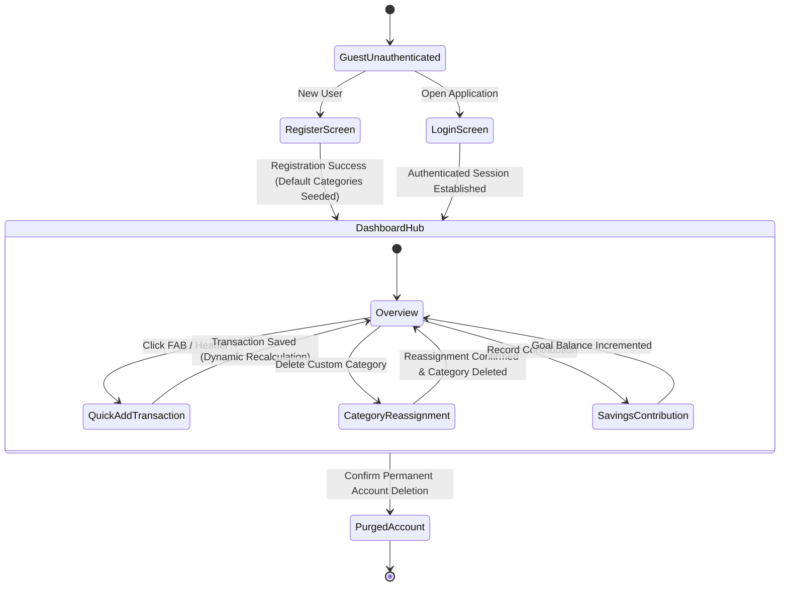

# Master UI/UX Architecture & Interaction Specification

**Application:** Personal Finance Manager (v1.0 MVP)  
**Role:** Senior Product Designer & UX Architect  
**Status:** Authoritative UX Architecture Specification  
**Traceability:** Implements requirements from [product-requirements.md](file:///home/blart/Documents/webProjects/FinanceManager/docs/product-requirements.md), [use-cases.md](file:///home/blart/Documents/webProjects/FinanceManager/docs/use-cases.md), [user-stories.md](file:///home/blart/Documents/webProjects/FinanceManager/docs/user-stories.md), [business-rules-and-edge-cases.md](file:///home/blart/Documents/webProjects/FinanceManager/docs/business-rules-and-edge-cases.md), and [backend-api-design.md](file:///home/blart/Documents/webProjects/FinanceManager/backend-api-design.md).

---

## 1. Executive Summary

This specification establishes the user experience (UX) architecture, interaction patterns, information hierarchy, navigation frameworks, state models, and accessibility standards for the **Personal Finance Manager**.

The application manages sensitive personal financial data. Therefore, the user interface prioritizes **visual clarity, speed of transaction logging, proactive financial feedback, non-destructive safety, and universal accessibility (WCAG 2.1 AA)** over superficial aesthetic novelty.

---

## 2. UX Goals & Core Principles

### 2.1 Primary UX Goals
1. **Instant Financial Clarity:** Enable users to assess their net financial health, monthly operational cash flow, and budget status within 3 seconds of opening the dashboard ([FR-010](file:///home/blart/Documents/webProjects/FinanceManager/docs/product-requirements.md#L57)).
2. **Frictionless Cashflow Entry:** Allow logging a new income or expense transaction in under 10 seconds from any screen in the application.
3. **Proactive Financial Discipline:** Provide unambiguous visual warning feedback (Yellow at 80%–99%, Red at 100%+) before overspending occurs ([FR-044](file:///home/blart/Documents/webProjects/FinanceManager/docs/product-requirements.md#L238)).
4. **Data Loss Prevention:** Enforce clear interaction safeguards for destructive actions, particularly custom category deletion with mandatory transaction reassignment ([BR-013](file:///home/blart/Documents/webProjects/FinanceManager/docs/business-rules.md#L73)) and permanent account purging ([BR-019](file:///home/blart/Documents/webProjects/FinanceManager/docs/business-rules.md#L106)).

### 2.2 Core UX Principles
* **Clarity Over Novelty:** Clean layouts, high-contrast monetary typography, and tabular figures (`font-mono`) ensure financial figures are unambiguous.
* **Proactive Feedback:** Every user mutation receives instant visual confirmation via optimistic UI updates, toast notifications, or inline validation messages.
* **Multi-Device Ergonomics:** The UI adapts seamlessly from multi-column desktop control panels to touch-first mobile interfaces featuring bottom-sheet drawers and floating action buttons.
* **Universal Accessibility:** Dual-coding (combining color, icons, and text labels) guarantees full usability for colorblind users and screen readers.

---

## 3. Information & Navigation Architecture

### 3.1 Global Information Architecture (IA)

```
Personal Finance Manager App
│
├── Public Routes (Guest Unauthenticated)
│   ├── Login Screen (/login)
│   ├── Registration Screen (/register)
│   ├── Forgot Password Request Screen (/forgot-password)
│   └── Reset Password Confirmation Screen (/reset-password)
│
└── Authenticated Application Shell (Protected)
    ├── Persistent Header Bar (Global Quick Add +, Currency Symbol, Theme Toggle, Profile Menu)
    ├── Desktop Sidebar Navigation / Mobile Bottom Bar Navigation
    │
    ├── Dashboard Hub (/dashboard)
    │   ├── Net Account Balance Card (Cumulative Net Position)
    │   ├── Monthly Cash Flow Summary (Income vs Expense)
    │   ├── Calendar Month Summary Selector
    │   ├── Budget Warning Status Alerts
    │   ├── Recent Activity Feed
    │   └── Category Spending Analytics Preview
    │
    ├── Transactions Ledger (/transactions)
    │   ├── Search & Multi-Parameter Filter Bar
    │   ├── Transaction Data Table (Desktop) / Cards List (Mobile)
    │   ├── Add Transaction Modal / Bottom Sheet
    │   ├── Edit Transaction Modal (Supports Backdating)
    │   └── Delete Transaction Confirmation Modal
    │
    ├── Category Management (/categories)
    │   ├── Income Categories Tab / Expense Categories Tab
    │   ├── System Default Categories List (Read-Only Badges)
    │   ├── Custom Categories List
    │   ├── Add / Edit Custom Category Modal
    │   └── Category Deletion & Mandatory Transaction Reassignment Modal
    │
    ├── Monthly Budgets (/budgets)
    │   ├── Calendar Month / Year Selector
    │   ├── Budget Health Summary Header
    │   ├── Category Budget Cards (Spending Limit, Actual Spent, Progress Bar)
    │   ├── Visual Warning Threshold Badges (Normal, 80% Yellow, 100%+ Red Alert)
    │   ├── Upsert Budget Modal
    │   └── Delete Budget Modal
    │
    ├── Savings Goals (/savings)
    │   ├── Active Goals / Completed Goals Tabs
    │   ├── Savings Goal Cards (Target, Accumulated Balance, Completion Date, Progress Bar)
    │   ├── Create / Edit Savings Goal Modal
    │   ├── Log Contribution Modal (Increments Accumulated Balance)
    │   └── Delete Savings Goal Modal
    │
    ├── Analytics & Insights (/analytics)
    │   ├── Category Expense Breakdown (Recharts Donut Chart)
    │   ├── Monthly Cash Flow Trends (Recharts Bar/Area Chart)
    │   └── Timeframe Selector
    │
    └── Settings & Profile (/settings)
        ├── User Profile Card (Display Name, Email, Avatar Upload)
        ├── Preference Settings Card (Display Currency Symbol, Dark/Light Theme)
        └── Security & Permanent Account Purge Card (Hard Purge Confirmation Modal)
```

### 3.2 Navigation Architecture

#### Desktop Navigation (Viewports $\ge$ 1024px)
* **Left Sidebar:** Collapsible vertical navigation containing primary links with active indicator states (`Dashboard`, `Transactions`, `Categories`, `Budgets`, `Savings`, `Analytics`, `Settings`).
* **Top Utility Header:** Contains global `+ Add Transaction` CTA button, active currency symbol indicator, theme toggle switch (`light`/`dark`), and user avatar dropdown menu.

#### Mobile Navigation (Viewports < 768px)
* **Bottom Navigation Bar:** Fixed bottom bar providing 5 primary touch targets (`Dashboard`, `Transactions`, `Budgets`, `Savings`, `Settings`).
* **Floating Action Button (FAB):** Prominent circular `+` button anchored bottom-right above the navigation bar for instant transaction creation.
* **Drawers & Bottom Sheets:** All form modals slide up smoothly as touch-friendly bottom sheets.

---

## 4. Key User Journeys & Interaction Patterns



### 4.1 Transaction Management Patterns
* **Quick Entry Pattern:** Triggered via persistent `+` button from any screen. Pre-fills current date in UTC. Displays toggle for `Expense` (default) vs. `Income`. Category dropdown dynamically filters to match selected type.
* **Historical Backdating Pattern:** Users can select past dates via calendar picker. Saving a backdated entry triggers a subtle banner alert: *"Historical transaction saved. Historical monthly summary and current net balance updated."* ([BR-006](file:///home/blart/Documents/webProjects/FinanceManager/docs/business-rules.md#L32)).

### 4.2 Category Reassignment Pattern
* When a user attempts to delete a custom category containing active transactions, immediate deletion is blocked ([BR-013](file:///home/blart/Documents/webProjects/FinanceManager/docs/business-rules.md#L73)).
* A mandatory **Category Reassignment Modal** appears:
  1. Displays notice: *"This category has X active transactions."*
  2. Offers dropdown selection for replacement category (defaults to `"Uncategorized"`).
  3. Single `Reassign & Delete` button executes atomic backend reassignment and category purge.

### 4.3 Budget Warning Threshold Patterns
* Budget cards monitor spending in real-time:
  - **Normal (< 80%):** Standard primary color progress bar.
  - **Approaching Limit (80%–99%):** Amber progress bar + `AlertTriangle` icon + `"85% Used - Approaching Limit"` badge ([FR-044](file:///home/blart/Documents/webProjects/FinanceManager/docs/product-requirements.md#L238)).
  - **Exceeded (100%+):** Crimson progress bar + `AlertOctagon` icon + `"115% Exceeded ($150.00 Over)"` alert badge. Transactions are **never blocked** by budget overruns ([EC-003](file:///home/blart/Documents/webProjects/FinanceManager/docs/business-rules-and-edge-cases.md#L118)).

---

## 5. UI State Architecture (The 5 Essential States)

Every screen component and data container explicitly handles 5 core UI states:

```
┌────────────────────────────────────────────────────────────────────────┐
│                          1. Loading State                              │
│         Skeletons & Shimmer Indicators (Matching Component Dimensions) │
└───────────────────────────────────┬────────────────────────────────────┘
                                    │
┌───────────────────────────────────▼────────────────────────────────────┐
│                          2. Ideal / Success State                      │
│            Full Interactive Data View (Tables, Cards, Charts)          │
└───────────────────────────────────┬────────────────────────────────────┘
                                    │
┌───────────────────────────────────▼────────────────────────────────────┐
│                          3. Empty State                                │
│       Contextual Illustration + Explanatory Text + Primary CTA Button  │
└───────────────────────────────────┬────────────────────────────────────┘
                                    │
┌───────────────────────────────────▼────────────────────────────────────┐
│                          4. Partial / Filtered State                   │
│        Filtered Empty Results Prompt + Clear Active Filters Button     │
└───────────────────────────────────┬────────────────────────────────────┘
                                    │
┌───────────────────────────────────▼────────────────────────────────────┐
│                          5. Error State                                │
│          Inline Field Warnings / Toast Banners / Retry Actions         │
└────────────────────────────────────────────────────────────────────────┘
```

1. **Loading State:** Component-matched Skeleton loaders maintain visual layout structure during async data fetching, eliminating layout shifts.
2. **Ideal / Success State:** Rich data displays with tabular numbers, interactive tooltips, and action buttons.
3. **Empty State (e.g. New User):** Contextual iconography + clear explanation + primary action prompt (e.g., *"No transactions logged yet. Add your first transaction to get started."* with `+ Add Transaction` button) ([EC-001](file:///home/blart/Documents/webProjects/FinanceManager/docs/business-rules-and-edge-cases.md#L116)).
4. **Filtered Empty State:** Triggered when search criteria return zero matches (e.g., *"No transactions match your search filter."* with `Clear Filters` button).
5. **Error State:** Form validation errors display inline beneath affected input fields; system errors display top-level toast banners with explicit `Retry` controls.

---

## 6. Form Behavior & Validation UX

* **Validation Timing:** Client-side Zod validation evaluates fields `onBlur` (when leaving a field) and `onSubmit`. Real-time validation clears error messages as the user types valid input.
* **Monetary Formatting:** Input fields automatically format values to 2 decimal places on blur (e.g. `25` $\rightarrow$ `25.00`). Negative entries are blocked with immediate helper text: *"Amount must be greater than zero."* ([BR-004](file:///home/blart/Documents/webProjects/FinanceManager/docs/business-rules.md#L21)).
* **Form Submission Safety:** Submit buttons display an active spinner and disable interaction during in-flight network requests to prevent duplicate submissions.

---

## 7. Destructive Actions & Modal Protocols

* **Single Entity Deletion (Transactions, Budgets, Savings Goals):** Displays a lightweight confirmation dialog highlighting entity details (e.g. *"Are you sure you want to delete expense 'Groceries $85.00'?"*). Requires explicit confirmation click.
* **Custom Category Deletion:** Requires mandatory transaction reassignment selection before the delete button activates ([BR-013](file:///home/blart/Documents/webProjects/FinanceManager/docs/business-rules.md#L73)).
* **Account Permanent Deletion:** High-friction destructive pattern ([BR-019](file:///home/blart/Documents/webProjects/FinanceManager/docs/business-rules.md#L106)). Requires entering the user's password and typing `"DELETE MY ACCOUNT"` into a confirmation field before the red `Permanently Delete All Data` button enables.

---

## 8. Accessibility Requirements (WCAG 2.1 AA Compliance)

1. **Color Contrast:** Text elements maintain a minimum contrast ratio of 4.5:1 against light/dark backgrounds (3:1 for large headings and icons).
2. **Non-Color Dependent Indicators:** All status indicators pair color with text and icons (e.g. Amber Bar + `AlertTriangle` icon + "85% Approaching Limit" label).
3. **Keyboard Traversal:** Complete keyboard accessibility via Tab navigation. Modals capture focus traps and close via `Escape` key (powered by Radix UI).
4. **Screen Reader Live Regions:** Monetary updates use `aria-live="polite"` regions announcing amounts clearly (e.g. *"Net balance updated: minus $250.00"*).
